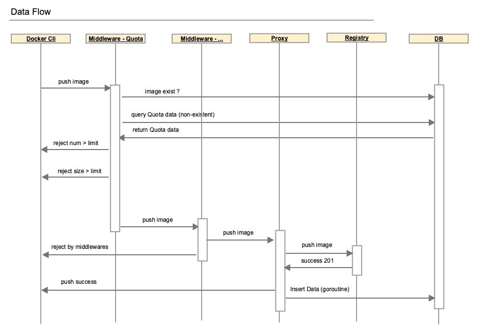
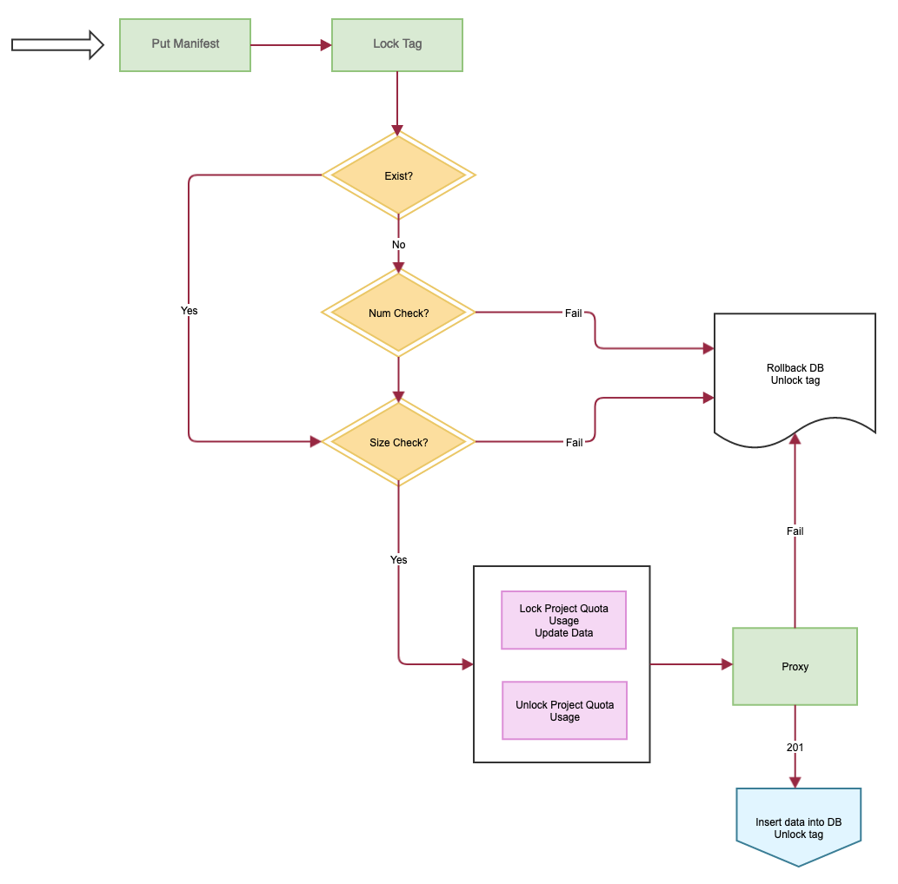
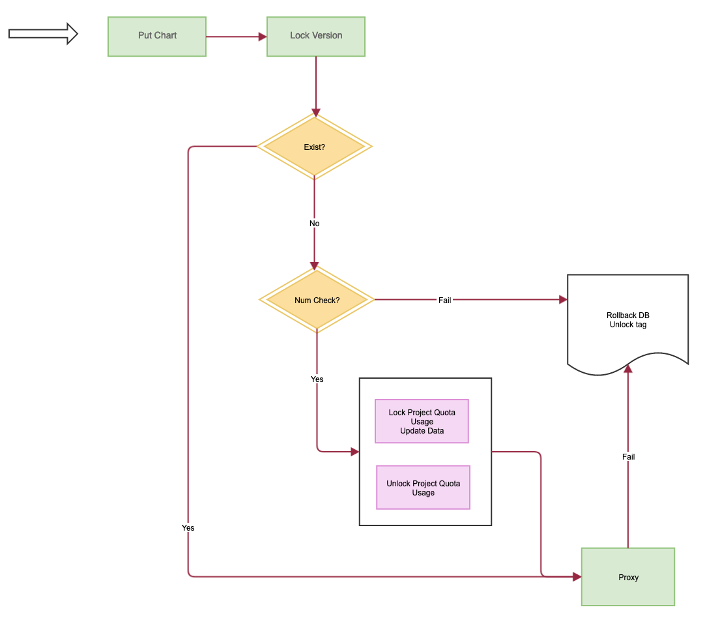
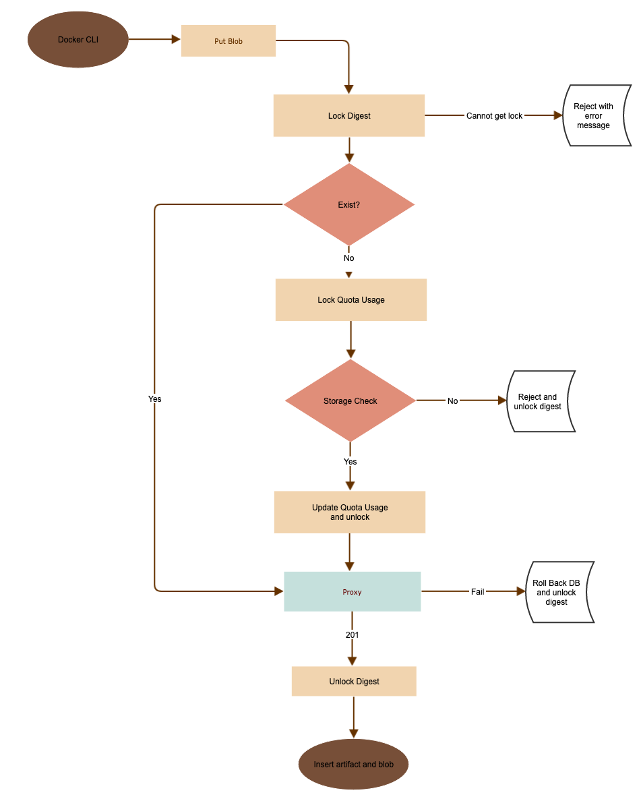
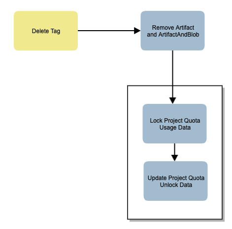
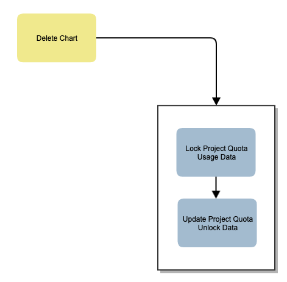

# Project Quota

Author: He Weiwei/Yan Wang

## Abstract

Harbor enforces quotas on resource usage of project, setting a hard limit on how much of a particular artifact count and storage your project can use.


## Background

Currently, users can push docker images, upload helm charts to harbor as many as possible without limit, the result is that one project will use up all resource of the system.

## User Stories

### Story 1
As a system administrator, I can set the default limit on project artifact count and project storage. But, I cannot control how many projects can Harbor have.

### Story 2
As a project administrator, I can only view basic quota information in project quota page, which includes quota usage, limits and errors. 

### Story 3 (OUT)
As a project administrator, I can exceed my project limit by sending the request to system admin and wait for response.

### Story 4
As a system administrator, I can view all project quota metrics in the quota management page.

### Story 5
As a system administrator, I can set the project quota in the quota management page, either on storage usage or artifact count or both, and only the new created project will inherit the new default value.

### Story 6
As a system administrator, If I update the default quota, the existing project won't be impacted.

### Story 7
As a system administrator, I can choose the whether to use the default or customized quota on creating a project.

### Story 8
As a user, I cannot see the default quota on creating a project, but I can get it in the quota tab.

## Premise
1, The shared blob in project won't be be double-counted.
2, The shared blob cross project will be be double-counted.

## Proposal

We propose the following solutions:

1. Add quota management page in administration so that system administrators can set storage and count quota for the project.
2. Add quota information page in the project to display the resources used by the project.
3. Modify or hook the docker distribution proxy handler in core component, require the storage and count resource for blob and manifest upload, denied push when new pushed image over the storage and count quota.
4. Modify or hook helm chart upload API, require the storage and count resource for blob and manifest upload, denied upload when new uploaded chart over the storage and number quota.
5. When delete image or helm chart, release the count resource of the project.
6. When GC, release the storage resource for the project.
7. Recalculate the storage usage by project when upgrade from old version.
8. Retag is actually do push blob and manifest to target project, it could be handled by #3 and #4.
9. Replication can be treated as push image, that can be handled by #3 and #4.
  
  
### APIs for quota and project

 1. List quotas

    ```
    GET /api/quotas/?reference=project&sort=-hard.storage
    [
    	{
    		"id": 1,
    		"ref": {
    			"id": 1,
    			"name": "library",
    			"owner_name": ""
    		},
            "hard": {
                "count": "100",
                "storage": "1048576"
            },
            "used": {
                "count": "10",
                "storage": "48576"
            }
    	},
    	{
    		"id": 1,
    		"ref": {
    			"id": 1,
    			"name": "library",
    			"owner_name": ""
    		},
    		"hard": {
                "count": "100",
                "storage": "1048576"
            },
            "used": {
                "count": "10",
                "storage": "48576"
            }
    	}
    ]
    ```
    
 2. Update quota

    ```
    PUT /api/quotas/:id
    {
    	"hard": {
    		"count": "100"
    		"storage": "100MB",
    	}
    }
    ```

3. Get summary of project

   ```
   GET /api/projects/:id/summary
   {
   	"quota": {
   		"hard": {
            "count": "100",
            "storage": "1048576"
        },
        "used": {
            "count": "10",
            "storage": "48576"
        }
   	}
   }
   ```
4. Update default quota for new created project

   ```
   PUT /api/configurations
   {
   	"count_per_project": "100",
   	"storage_per_project": "1.5GB"
   }
   ```


### DB scheme

```
CREATE TABLE quota (
 id SERIAL PRIMARY KEY NOT NULL,
 reference VARCHAR(255) NOT NULL,
 reference_id VARCHAR(255) NOT NULL,
 spec JSONB NOT NUL, 
 hard JSONB NOT NUL,
 creation_time timestamp default CURRENT_TIMESTAMP,
 update_time timestamp default CURRENT_TIMESTAMP,
 UNIQUE(reference, reference_id)
)

CREATE TABLE quota_usage (
 id SERIAL PRIMARY KEY NOT NULL,
 reference VARCHAR(255) NOT NULL,
 reference_id VARCHAR(255) NOT NULL,
 used JSONB NOT NUL,
 creation_time timestamp default CURRENT_TIMESTAMP,
 update_time timestamp default CURRENT_TIMESTAMP,
 UNIQUE(reference, reference_id)
)
```

### Quota Manager

Quota manager is used to new quota, update quota spec, add resources and subtract resources for reference object.

```go
// Manager manager for quota
type Manager struct {
	schema      types.ResourceSpecSchema
	reference   string
	referenceID string
}

// NewQuota create new quota for (reference, reference id)
func (m *Manager) NewQuota(spec types.ResourceSpec, usages ...types.ResourceList) (int64, error) {
	// ...
}

// EnsureQuota create new quota  for (reference, reference id) if not exists
func (m *Manager) EnsureQuota(spec types.ResourceSpec, usages ...types.ResourceList) (int64, error) {
  // ...
}

// UpdateQuota update the quota resource spec
func (m *Manager) UpdateQuota(spec types.ResourceSpec) error {
	// ...
}

// AddResources add resources to usage
func (m *Manager) AddResources(resources types.ResourceList) error {
	// ...
}

// SubtractResources subtract resources from usage
func (m *Manager) SubtractResources(resources types.ResourceList) error {
	// ...
}

// NewManager returns quota manager
func NewManager(reference string, referenceID string) (*Manager, error) {
	d, ok := driver.Get(reference)
	if !ok {
		return nil, fmt.Errorf("quota not support for %s", reference)
	}

	return &Manager{
		schema:      d.Schema(),
		reference:   reference,
		referenceID: referenceID,
	}, nil
}
```

There is a `Driver` interface for reference object which want to implement quota.

```go
// RefObject type for quota ref object
type RefObject map[string]interface{}

// Driver the driver for quota
type Driver interface {
	// Load returns quota ref object by key
	Load(key string) (RefObject, error)
	// Schema returns resource spec schema for the driver
	Schema() types.ResourceSpecSchema
}
```


### Solution on Registry

## DB scheme

Table -- Blob

```
CREATE TABLE Blob (
 id SERIAL PRIMARY KEY NOT NULL,
 /* 
    digest of config, layer, manifest
 */ 
 digest varchar(255) NOT NULL,
 content_type varchar(255) NOT NULL,
 size int NOT NULL,
 UNIQUE (digest)
);
```

Table -- Artifact

```
CREATE TABLE Artifact (
 id SERIAL PRIMARY KEY NOT NULL,
 project_id int NOT NULL,
 repo varchar(255) NOT NULL,
 tag varchar(255) NOT NULL,
 /* 
    digest of mainfest
 */
 digest varchar(255) NOT NULL,
 kind varchar(255) NOT NULL,
 CONSTRAINT unique_artifact UNIQUE (project_id, repo, tag)
);
```

Table -- ArtifactAndBlob

```
CREATE TABLE ArtifactAndBlob (
 id SERIAL PRIMARY KEY NOT NULL,
 digest_af varchar(255) NOT NULL,
 digest_blob varchar(255) NOT NULL
);
```

## Data Flow in Docker registry

#The date flow to push a image into Harbor:

  


#The execution flow of putting a manifest:

  

#The execution flow of putting a chart:

  
    

#The execution flow to putting a blob:

  
  
The details to handle blob:
1, for patch blob request, it records the size which is in the response header(Range) in redis on complete
Range: Range indicating the current progress of the upload, for details, 
just refer to https://github.com/opencontainers/distribution-spec/blob/master/spec.md#get-blob-upload
2, for put blob request -- it means all of the data have been uploaded successfully into registry. 
It requires quota for this blob if not exist. 

#The execution flow of deleting a tag:

  


#The execution flow of deleting a chart:

  
  
#The execution flow of retaging a repository:

Retag is actually a mount request, similar with push a existing image. It handles by blob and manifest interceptor.

### Failure cases 
1, If 1 repo number left and enough storage, Harbor could let only one image pass in multiple push scenario, 
but the failure push has already put blobs into the Harbor and consume the storage.

2, If 100 MB storage quota left, there are 3 push in parallel, 70M, 90M, 20M. In fact, Harbor should let at least one of them pass. 
But, if we count size for blob, all of them may fail.    

3, If hello-world has already in Harbor with 100MB, but the user rebuilds it to a 10MB image and push it again into Harbor.
This will cost 110MB(100MB + 10MB) in Harbor unless to execute garbage collection to delete untagged.   

## API
 1. Registry Dump (Sysadmin only)

  ```
  POST /api/internal/dumpregistry
  ```

The API is for system admin to fix gap between registry and Harbor DB, and the benchmark is the data in docker registry.
1. It provides an way for system admin to fix the quota data bases on registry.
2, We could add the dump API call in the GC job, so that each time run GC, Harbor could have a chance to align data.
3, It can be used into the migration process.

## GC
Actually, the quota usage of projects happends at the time of executing GC. As GC will put Harbor into read only, we will one more step
to update the usage according the record in artifact table.

## Consideration of performance [Out of scope] 
1, Docker push.
> Redirect the HEAD request to DB before pushing a blob.

2, Registry Client in Core.
> Replace the API by calling DB, like get manifest, layer digest, image size.

## Non-Goals

# Docker images
Don't split the shared image layer size into pieces, each shared layer will count its size into the total size of a project.
It causes the total usage of a Harbor instance is not reflect true value.

## Compatibility
It has to consider how to handle the migration from older version, like v1.7.0.
1, set the quota of all of projects to infinite(-1).
2, load data from registry, and compute all of projects quota usage and update them into harbor DB -- called in harbor launch, and defined by whether has data in quota_usage.

This must be done before new version launch.