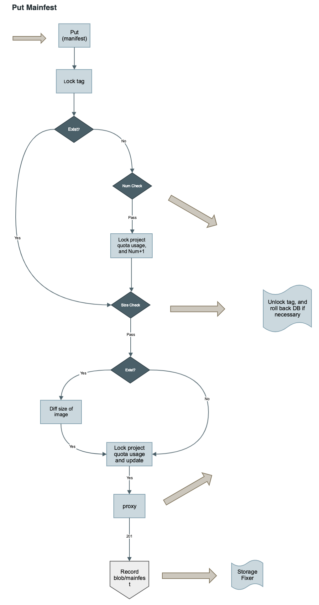

hweiwei


Message List

Weiwei He [1:12 PM]
Project-Quota.md 
# Project Quota
​
Author: He Weiwei/Yan Wang
​
## Abstract
​
Harbor enforces quotas on resource usage of project, setting a hard limit on how much of a particular artifact count and storage your project can use.
​
​
## Background
​
Currently, users can push docker images, upload helm charts to harbor as many as possible without limit, the result is that one project will use up all resource of the system.
​
## User Stories
​
### Story 1
As a system administrator, I can set the default limit on project artifact count and project storage. But, I cannot control how many projects can Harbor have.
​
### Story 2
As a project administrator, I can only view basic quota information in project quota page, which includes quota usage, limits and errors. 
​
### Story 3 (OUT)
As a project administrator, I can exceed my project limit by sending the request to system admin and wait for response.
​
### Story 4
As a system administrator, I can set the project quota, either on storage usage or artifact count.
​
### Story 5
As a system administrator, I can view all project quota metrics via a dashboard.

### Story 5
As a system administrator, If I update the default quota, the existing project won't be impacted.
​
​
## Proposal
​
We propose the following solutions:
​
1. Add quota management page in administration so that system administrators can set storage and number quota for the project.
2. Add quota information page in the project to display the resources used by the project for project administrators.
3. Modify or hook the docker distribution proxy handler in core component, denied push when new pushed image over the storage and number quota.
4. After image uploaded or deleted, update the storage usage of the project.
5. Modify or hook helm chart upload API, denied upload when new uploaded chart over the storage and number quota.
6. After helm chart uploaded or deleted, update the storage usage of the project.
7. Recalculate the storage usage by project whe upgrade from old version.
​
​
### APIs for quota
 1. List quotas of the projects
    ```
    GET /api/project-quotas/
    [
        {
            "id": "1", // the id of project
            "storage_hard": 1048576,
            "storage_used": 524288,
            "number_hard": 100,
            "number_used": 50
        },
        {
            "id": "2",
            "storage_hard": 1048576,
            "storage_used": 524288,
            "number_hard": 100,
            "number_used": 50
        }
    ]
    ```
    
 3. Read quota for the project
    ```
    GET /api/project-quotas/:id
    {
      "id": "1",  // the id of project
      "storage_hard": 1048576,
      "storage_used": 524288,
      "number_hard": 100,
      "number_used": 50
    }
    ```
 2. Update quota for the project
    ```
    PUT /api/project-quotas/:id
    {
        "storage_hard": 2097152,
        "number_hard": 150
    }
    ```
    
### DB scheme

```
CREATE TABLE quota (
 id SERIAL PRIMARY KEY NOT NULL,
 reference VARCHAR(255),
 reference_id VARCHAR(255),
 resource VARCHAR(255),
 hard BIGINT,
 UNIQUE(content_type, object_id, resource)
)
CREATE TABLE quota_usage (
 id SERIAL PRIMARY KEY NOT NULL,
 reference VARCHAR(255),
 reference_id VARCHAR(255),
 resource VARCHAR(255),
 used BIGINT,
 metadata VARCHAR(1024),
 UNIQUE(content_type, object_id, resource)
)
```


### Quota Manager

```go

type QuotaManager struct {
  reference string
  referenceId string
}

func (m *QuotaManager) RequestResource(resource string, value int64) error {
  // 1. SELECT * FROM quota 
  //            WHERE content_type = ? AND object_id = ? AND resource = ? FOR UPDATE
  // 2. Check and ensure used + value < hard
  // 3. UPDATE quota SET used = used + value WHERE id = ?
}
func (m *QuotaManager) ReleaseResource(resource string, value int64) error {
  // 1. SELECT * FROM quota 
  //            WHERE content_type = ? AND object_id = ? AND resource = ? FOR UPDATE
  // 2. Check and ensure used + -value < hard
  // 3. UPDATE quota SET used = used + -value WHERE id = ?
}
func (m *QuotaManager) UpdateResourceHard(resource string, hard int64) error {
  // 1. SELECT * FROM quota 
  //            WHERE content_type = ? AND object_id = ? AND resource = ? FOR UPDATE
  // 2. UPDATE quota SET hard = hard WHERE id = ?
}
func (m *QuotaManager) UpdateResourceUsed(resource string, used int64) error {
  // 1. SELECT * FROM quota 
  //            WHERE content_type = ? AND object_id = ? AND resource = ? FOR UPDATE
  // 2. UPDATE quota SET used = used WHERE id = ?
}
func NewQuotaManager(reference string, referenceId string) *QuotaManager {
  // ...
}

```

​​
### Solution on Registry
​
## DB scheme
​
Table -- Blob

```
CREATE TABLE Blob (
 id SERIAL PRIMARY KEY NOT NULL,
 /* 
    digest of config, layer, manifest
 */ 
 digest varchar(255) NOT NULL,
 content_type varchar(255) NOT NULL,
 size int NOT NULL,
 UNIQUE (digest)
);
```

Table -- Artifact

```
CREATE TABLE Artifact (
 id SERIAL PRIMARY KEY NOT NULL,
 project_id int NOT NULL,
 repo varchar(255) NOT NULL,
 tag varchar(255) NOT NULL,
 /* 
    digest of mainfest
 */
 digest varchar(255) NOT NULL,
 kind varchar(255) NOT NULL,
 CONSTRAINT unique_artifact UNIQUE (project_id, repo, tag)
);
```

Table -- ArtifactAndBlob

```
CREATE TABLE ArtifactAndBlob (
 id SERIAL PRIMARY KEY NOT NULL,
 digest_af varchar(255) NOT NULL,
 digest_blob varchar(255) NOT NULL
);
```
​
## Data Flow in Docker registry
​
The date flow to push a image into Harbor:
​
  
  

The execution flow to put a manifest:

  
  
### Failure cases
1, Storage overuse. If we let the all of blobs pass the flow, the real storage usage could larger than quota usage.

  
The execution flow to put a blob:

  
  
### Failure cases 
1, Quota overuse. If 1 repo number quota left, Harbor could let only one image pass in multiple push scenario, but other blobs already count into the usage.

2, If 100 MB storage quota left, there are 3 push in parallel, 70M, 90M, 20M. In fact, Harbor should let at least one of them pass. 
But, if we count size for blob, all of them may fail.        
​
## API
 1. Registry Dump (Sysadmin only)
​
  ```
  POST /api/internal/dumpregistry
  ```
​
## Consideration of performance
1, Docker push.
> Redirect the HEAD request to DB before pushing a blob.
​
2, Registry Client in Core.
> Replace the API by calling DB, like get manifest, layer digest, image size.
​
## Non-Goals
​
# Docker images
Don't split the shared image layer size into pieces, each shared layer will count its size into the total size of a project.
It causes the total usage of a Harbor instance is not reflect true value.
​
## Compatibility
It has to consider how to handle the migration from older version, like v1.7.0.
Collapse