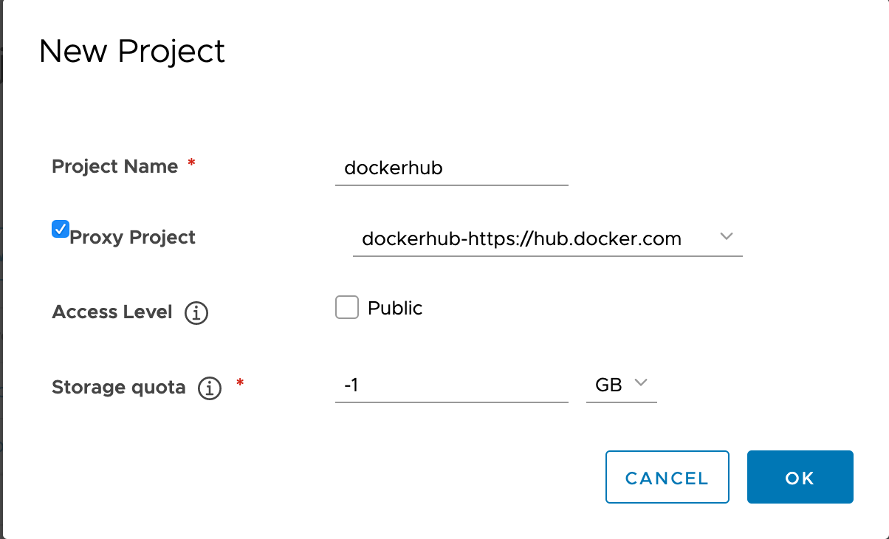
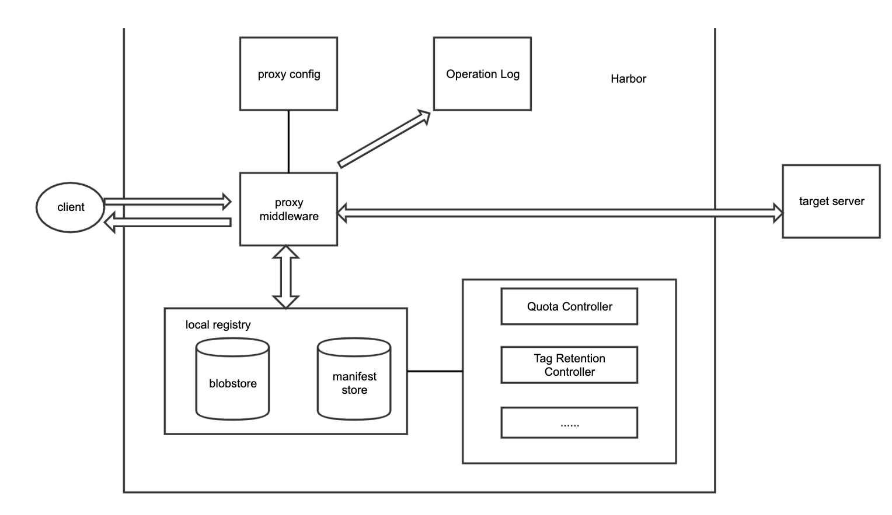
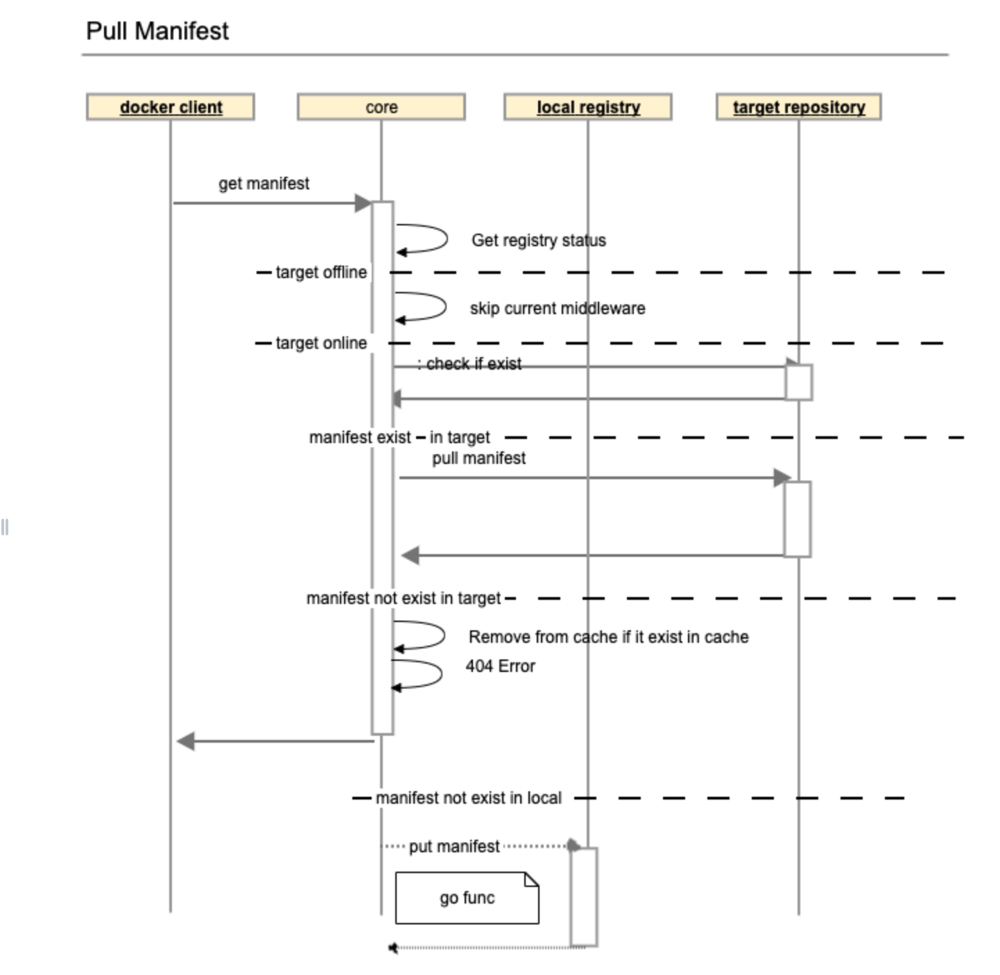
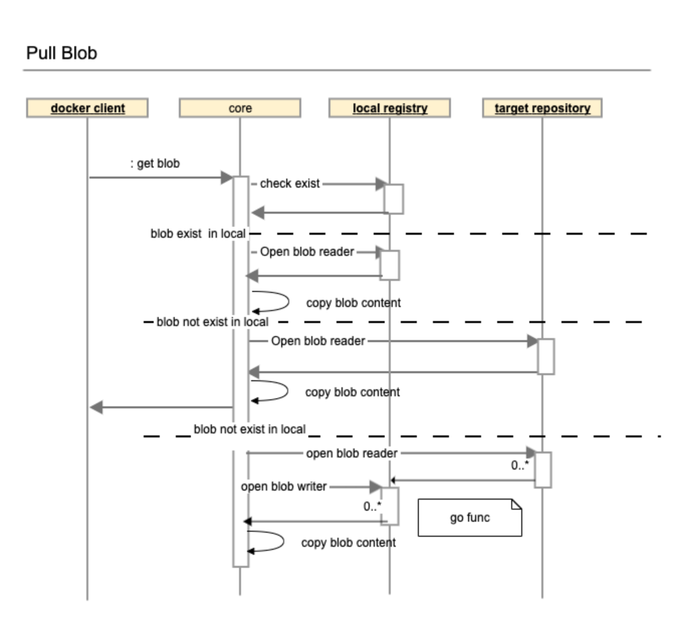

# Proposal:  `Proxy Project`

Author: `stonezdj` `ywk253100`

## Abstract

It proposes an approach to enable Harbor to support proxy remote container registries. 

## Background

For some cases, docker nodes reside in the environment have limit access to internet or no access to the external network to public container registry, or there are too many requests to the public repository that consumes too much bandwidth, or it is at the risk of being throttled by the server. There is a need to proxy and cache the request to the target public/private container repository.

## Proposal

We can enhance the current project implementation by adding a proxy project type. 

As a Harbor system admin, the user can create a new proxy project in Harbor, and associate an existing registry to it for proxy.



As a common user in Harbor, if the user is already login and has the permission to the proxy project. if he need to pull the image:
```
docker pull example/hello-world:latest
```
After the login, the user can pull the image by adding a prefix to image name:  `<harbor_servername>/<projectname>/`

```
docker login <harbor_servername> -u xxxx -p *****
docker pull <harbor_servername>/dockerhub_proxy/example/hello-world:latest
```
For kubernetes, the user can update the pod spec manually or update it with a mutating webhook.

```
apiVersion: v1
kind: Pod
metadata:
  name: nginx
spec:
  containers:
  - name: nginx
    image: nginx
    ports:
      - containerPort: 80
```
It should be updated to:
```
apiVersion: v1
kind: Pod
metadata:
  name: nginx
spec:
  containers:
  - name: nginx
    image: <harbor_servername>/dockerhub_proxy/library/nginx
    ports:
      - containerPort: 80
 imagePullSecrets:
    - name: myregistrykey
```

When a pull request comes to the proxy project, if the image is not cached, it pulls the image from the target server, dockerhub.com, and serves the pull command as if it is a local image. after that, it stores the proxied content to local cache. when same request comes the second time, it checks the latest manifest and serves the blob with local content. if the dockerhub.com is not reachable, it serves the image pull command like a normal Harbor project.

Excessive pulling from hosted registries like dockerhub might result in throttling or IP ban, the pull through proxy feature can help to reduce such risks.

The project admin can set up a retention policy for the proxy project, such as keep last 7 days visited images on the disk. 

## Goal

The proxy middleware involves pull requests to container images, we will compare the pull command under these conditions:

* Pull image from a normal Harbor project 
* Pull image from a proxy project with all images are cached in local

Because the proxy project needs to pull images from a remote registry, and have some concurrent limitation on the request, the overall image pull performance degradation must less than 50%. 

## Non-Goals

The current solution proxy container images request on project level, is not a whole Harbor server level, it is different with the docker distribution's solution [pull through proxy cache](https://docs.docker.com/registry/recipes/mirror/)

The proxied artifact only includes container images.

In a proxy project, all push requests to proxy project is forbidden. Other project related features are  unchanged. Content trust is disabled by default in the proxy project. Other features related to Harbor projects, such as the project membership, label, scanner, tag retention policy, robot account, web hooks, CVE whitelist should work as they were.

## Terminology


* Target server — The original container registry server
* Proxy Server — The Harbor server that receives the request from client and proxy the request to the target server if when required.
* Proxy Cache - The local repository to store the proxied container image. 

## Compatibility

Support to proxy the dockerhub.com or Harbor. 
Support docker client and containerd.

## Implementation

### Basic mechanism

A docker image pull command can be decomposed into several HTTP request. For example:
```
docker pull library/hello-world:latest
```
The HTTP request to get the content of manifest library/hello-world:latest, this request will send to the repository, and the repository intercept the request to the example/hello-world:sha256:xxxxxxxx, and its response with that of get the manifest blob.

```
# The background HTTP authentication request which can be handled by replication adapter 
GET /v2/
GET /service/token?account=admin&scope=&scope=repository%3Alibrary%2Fhello-world%3Apush%2Cpull&service=harbor-registry
GET /v2/library/hello-world/manifests/latest
# change to actual request in background
GET /v2/library/hello-world/blobs/sha256:92c7f9c92844bbbb5d0a101b22f7c2a7949e40f8ea90c8b3bc396879d95e899a
```
The client parses the content of the manifest, then get all dependency blobs.
```
GET /v2/library/hello-world/blobs/sha256:1b930d010525941c1d56ec53b97bd057a67ae1865eebf042686d2a2d18271ced
GET /v2/library/hello-world/blobs/sha256:fce289e99eb9bca977dae136fbe2a82b6b7d4c372474c9235adc1741675f587e
```

In summary, the proxy middleware need to handle the GET method to manifests and blobs. 

### Components


### Get manifest

To enable the proxy feature in Harbor, it is required to add a proxy middleware, which detects HTTP requests of docker pull command. If it is a request to get the manifest, get it in the target server and proxied the latest manifest to the client, then cache the content in local registry later, if the manifest doesn't exist in the target server, clean it from cache if exist.


### Get blob

For get blob request, it tries to get the blob in local cache first, if not exist, get the blob from the target server, then store the content to the local registry. When same request comes the second time, then serves the request with the cached content. When the target server is offline, serves the pull request like a normal project.

Because some blobs size might be very large, to avoid out of memory, using the io.CopyN() to copy the blob content from reader to response writer. 
It is likely many requests pull same blob in a period, to avoid put same blob multiple times, setup an inflight map to check if there is any existing proxy blob request. If exist, skip to put the blob into proxy cache.



### HEAD method of manifest and blob

Because there is no use case that requires to proxy HEAD request, it won't be proxied.

### Cache Storage

Cached manifests and blobs are stored in the local storage in the same way as normal repository. In a typical docker pull command, the get request of manifest comes before requests to blobs. the proxy always receives the content of manifest before receiving blobs, thus there is a dependency check to wait for all related blobs are ready. It sends HEAD request to check if the current blob exist.  When all dependent blobs are ready, push the manifest into the local storage. If it exceeds the max wait time (30 minutes), the current push manifest operation quit. 

The replication adapter push the images to local repository, it sends HTTP requests to the core container with a temporary service account: harbor-proxyservice.

If the image is pull from library/hello-world:latest, the actual storage share with the current registry, named with
dockerhub_proxy/library/hello-world:latest, and share the same blob storage with other repos.
Use this command to pull the latest image from Harbor repository.
```
docker pull <harbor_fqdn>/dockerhub_proxy/library/hello-world:latest 
```
The quota usage of the current project is the size of cached images approximately.

** Notes ** The image cache is handled by subsequent go functions after pull command, it also can be implemented by replication job. Because the replication job schedule the replication job in different component and container. In order to cache the content more quickly, we prefer use the go function to cache proxied image.

#### Manifest list

A manifest list contains one or more references to the manifest for different platforms. when a docker client run a pull image request, it only pulls image for a specific platform, the proxy server pull and cache parts blobs and manifest in the manifest list. 
For example, the busybox:latest is a manifest list, when pulling it on an amd64 linux platform.
```
docker pull busybox:latest
```
Only the os=linux, arch=amd64 image will be download. the other platform such as the arm, ppc will not be download and cached.

When pushing this manifest list to local proxy cache, the proxy server need to remove the missing blobs from the manifest, and push the modified manifest, because it modifies the manifest, the manifest list's digest will change.

Another case is the CNAB manifest list, which contains some manifests of same platform, the proxy server should wait all depend on manifest and blobs ready.

Based on two cases, the proxy server should check the dependencies every 20-30 seconds, if all dependencies met, then push the manifest list, if some dependencies are not ready, it will wait until timeout, after timeout, it will update the manifest list correspondent with the existing manifest and blobs.

The timeout for the manifest list should be longer than that of normal manifest, because it depends on normal manifests.


#### Skipped blobs

When the pull command issued from a machine where some blobs already exist, the client might skip to download existing blobs, and the proxy server will never receive the pull request to these blobs, and the wait dependency blobs operation will timeout and quit to push the manifest to proxy cache because of missing depend on blobs, thus the proxy server need to push the missing blobs to local to avoid this type of failure.

#### Cached Image expire

The cached tags can be deleted from the server storage after a period (for example 1 week), and only tags are removed, use the GC to free the disk space used by blobs. there will be an expiry date in the artifact. when the time expires, the image will be removed.

### Push Image

The proxy server forbid the push request to the proxy project. it uses middleware to check, if the current project is a proxy project, only harbor-proxyservice can push image to the proxy project. The proxy server use the harbor-proxyservice to store the cached image to local proxy cache.

### Mutating webhook

TBD

### Data Models

Add a column proxy_registry_id in project table, if the proxy_registry_id is non-zero, the project is proxy project.

### API Change

Add a new field in the project API for POST and GET

Method | URL  | Request Body   | Response
---   | ---- | -------------- | ---------
POST | /projects | { "project_name": "sample_project","proxy_registry_id": 1,"metadata": {"public": "true"}} | 200 - Updated metadata successfully. <br/>400 - Invalid request. <br/>401 - User need to log in first. <br/>403 - User does not have permission to the project. <br/>404 - Project or metadata does not exist. <br/>500 - Internal server errors.
GET | /projects |    | 200 - { "project_name": "sample_project", "proxy_registry_id": 1 } <br/>400 - Invalid request. <br/>401 - User need to log in first. <br/>403 - User does not have permission to the project. <br/>404 - Project or metadata does not exist. <br/>500 - Internal server errors.

### Impact to existing feature

In order to reduce the impact of existing project implement, proxy projects keep the most of the project function as much as possible. except for pushing image is disabled.  

Name  | Change | Justification |
------|  ------ | --------------------------- 
Pull image  |  Yes    |  Discussed in implementation
Push image  |  Yes    |  It is not allowed to push image to a proxied project, but it is supported to push to the normal project. this feature is implemented by a PUT middleware on manifest.
content trust | Yes | Disabled 
RBAC  |  No     | If current user has permission to access the current project, pull image and cache the images.  each role include guest, master, developer, admin can use the proxy to pull image from remote server. if current user has no permission to access the current project, it returns 404 error to the client.
Tag retention | No | 
Quota | No | Cached images are stored in local through replication adapter, its push requests are handled by core middleware, there is no need to handle the quota in the proxy middleware.
vulnerability scan | No | 
AuditLog | No | 


## Open issues

* All engineering work should be tracked by the Epic:https://github.com/goharbor/harbor/issues/11658
