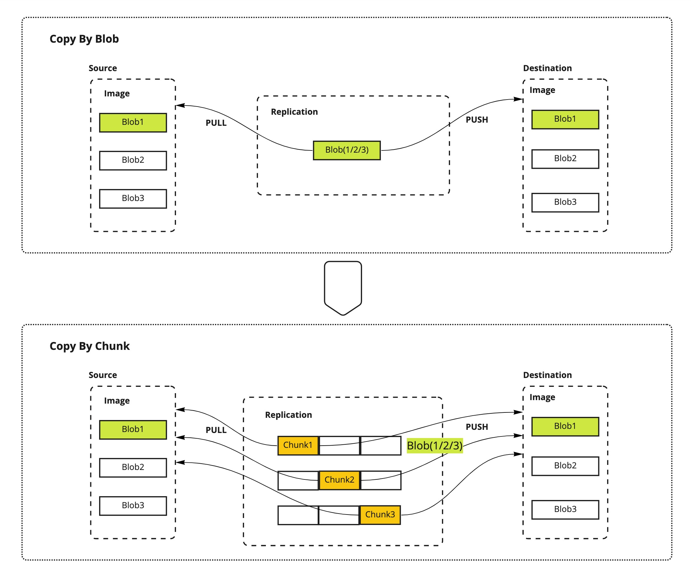
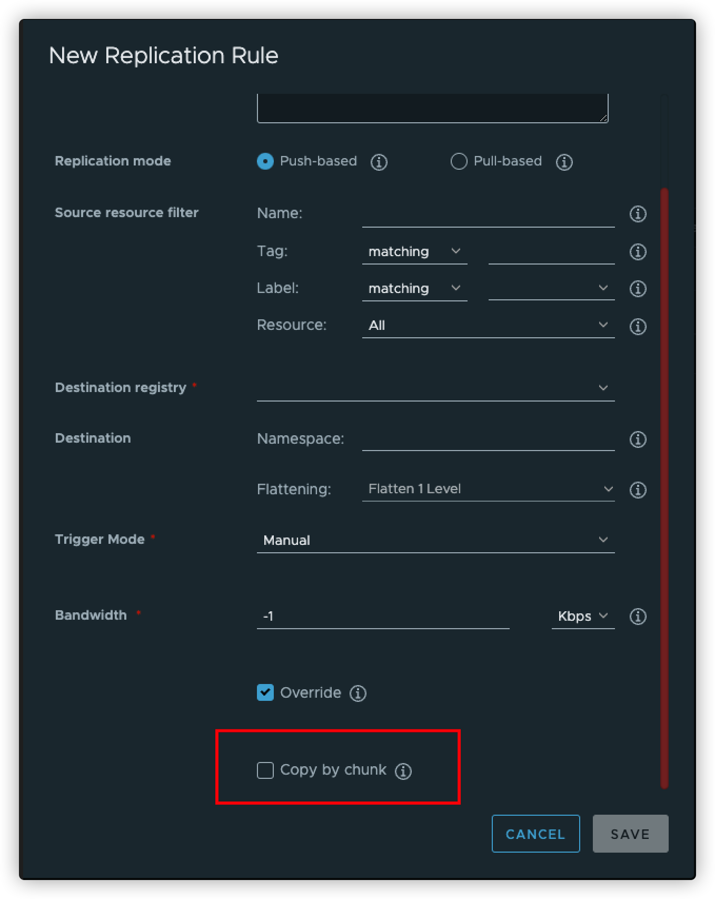
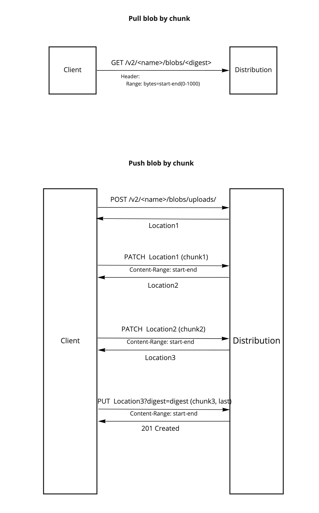
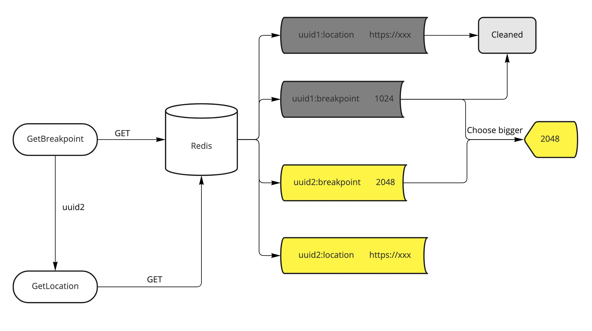
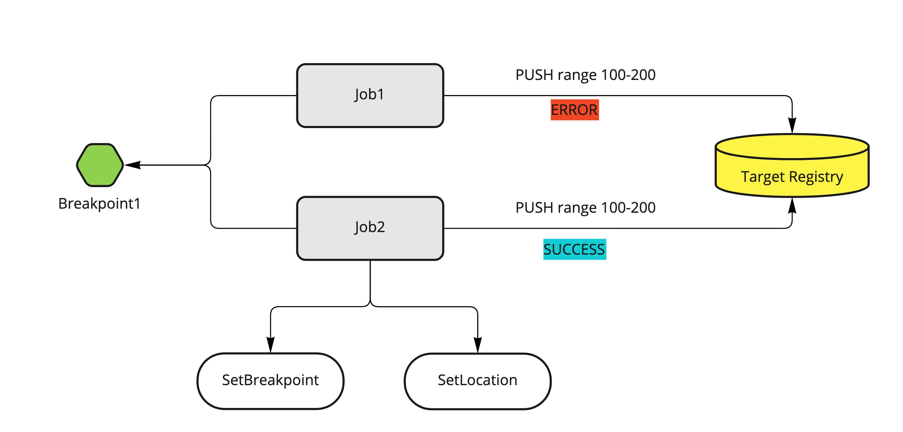

# Copy over chunk for replication

Author: ChenYu Zhang/[chlins](https://github.com/chlins)

## Abstract

Support copy over chunk when copying image blobs for harbor replication.

## Background

With the development of edge compute, the image registry such as harbor be deployed by sink to edge nodes to achieve
the better performance and independence. For some user cases, they need to replicate images from one center harbor to
edge harbors, but usually the network for edge is restrict and even unstable. The `Low Bandwidth` and `High Latency` environment
is the big challenge for replication. So we need to support copy over chunk for replication to improve the quality.

## Goals

- Improve the quality of the layer copying for the replication.
- Boost the cost time for replication when issues occurred.(such as network jitter, service restart)

## Proposal

Add option in the replication policy to identify whether need to enable copy over chunk(default is not as before), the per chunk size has a default value and
is not recommended for user config, but user can override it by ENV if really want to change. Introduce `PullBlobChunk` and `PushBlobChunk` to the registry client interface
and implement copy by chunk logic for the replication job. Define 2 phases based different scope to import this feature, the 1st phase provide the availability and support basic function, for the 2st phase will enhance and bring up breakpoint and resume mechanism by redis.

The size of chunk not exposed for API, the default chunk size is `10 MB`, but user can override it by set the environment variable `REPLICATION_CHUNK_SIZE`.

### Phase 1

**Scope:**

Support replication copy by chunk, and retry copy chunk if error.

### Phase 2

**Scope:**

Chunk resuming crossing the job/execution/policy and multiple times execution(e.g. job retry), cache chunk location and last end range in redis.

## Rationale



If the user copy a image by blob, when network broken in the transferring, then replication needs to re-pull and re-push the entire blob for the next time
retry, but if copy by chunk, retry just needs to re-pull and re-push from the last pushed chunk. For example, take a relatively extreme example, if a blob size is 100MB and push this blob cost about 10mins based on the network limit, sudden network jitter happened in the end pose to only remain 1MB not be replicated, it needs to re-pull and re-push entire 100MB which cost about 10mins again if copy by blob, but if copy by chunk and assume the chunk size is 1MB,
it only needs to replicate the last 1MB by chunk in several seconds because the copied chunk are already exist in the target storage and purge job usually has the time window which only clean the useless file before # days. So that can greatly improve the execution time in this case.

## Implementation

### UI

A new checkbox `Copy by chunk` will be added in the replication rule edit page, default is not checked.



The tooltip content: `Specify whether to copy the blob by chunk, transfer by chunk may increase the number of API requests.`

### DB Scheme

A new field `CopyByChunk` will be added to the policy model.

```go
type Policy struct {
    // ...
    CopyByChunk                     bool     `orm:"column(copy_by_chunk)"`
}
```

Add migrate sql for upgrade.

```sql
ALTER TABLE replication_policy ADD COLUMN IF NOT EXISTS copy_by_chunk boolean;
```

### API

*create policy*

```rest
POST /replication/policies

{
    ......
    "copy_by_chunk": true
}
```

*update policy*

```rest
PUT /replication/policies

{
    ......
    "copy_by_chunk": true
}
```

### Interface & Process

The chunk API as described in the OCI distribution [spec](https://github.com/opencontainers/distribution-spec).



Regarding the replication, currently all the adapter composite the same underlying registry Client interface which defines the common operations to the distribution V2 API, but have no chunk related API, so extend 2 methods for chunk.

```go
type Client interface {
    // PullBlobChunk pulls the specified blob, but by chunked
    PullBlobChunk(repository, digest string, start, end int64) (size int64, blob io.ReadCloser, err error)
     // PushBlobChunk pushes the specified blob, but by chunked
    PushBlobChunk(repository, digest string, start, end int64, chunk io.Reader) error
}
```

#### Phase 1 Implementation

Implement the `PullBlobChunk` and `PushBlobChunk` methods, and support the retry for copy by chunk as before retry for blob.

The retry for chunk adopts the same strategy with blob, default 5 times and can be configured by environment.

#### Phase 2 Implementation

**NOTICE**: This phase has not been fully discussed and details needed to be padded.

The following is just the initialize thought about this part, feel free to leave your comments.

The key point of phase 2 is **`Breakpoint & Resume`**.

From the process of chunk API, we need to store the location for next chunk push and the last pushed chunk end range, so we need to define common interface for easily integration and adapter in the future.

```go
type ChunkRecorder interface {
    // GetUploadLocation gets the location of upload next chunk
    GetUploadLocation(src, dst, digest uuid string) (string, error)
    // GetBreakpoint gets the breakpoint
    GetBreakpoint(src, dst, digest uuid string) (int64, error)
    // SetUploadLocation sets the upload location
    SetUploadLocation(src, dst, digest, uuid, location string) error
    // SetBreakpoint sets the break point
    SetBreakpoint(src, dst, digest, uuid string, point int64) error
    // Clear clean ups the breakpoint and location
    Clear(src, dst, digest string) error
}
```

Implement the redis chunk recorder which cache the location and breakpoint in the redis, can share with multiple shadow or concurrent jobs, still be persisted when the job was error and used for next retry. Only lost when the redis data was gone.

The key format of location.

`replication:{src}:{dst}:{digest}:{uuid}:location`

The key format of breakpoint.

`replication:{src}:{dst}:{digest}:{uuid}:breakpoint`

In the normal case, with the same src and dst should only have one record for location and breakpoint, but here we inject the uuid as key to handle the special case which can lead to conflict. There are following situations which can cause multiple locations and breakpoints for the same src and dst by diff uuid.

- The event-based replication triggered by concurrent push for one image.
- The replication manually triggered by concurrent API call.

##### Resume mechanism

1. Select the bigger one breakpoint. (as the bigger one has pushed more chunks)
2. Cleanup the other remain breakpoints and their locations.



*What happened if multiple jobs resume from the same breakpoint?*



As the distribution should validate the chunk size, range and location, and will throw the 416 ERROR if the request can not match, so although multiple jobs push the chunk with the same breakpoint, there is only one job can success, other jobs will be failed. In summary, finally only one job can set location and breakpoint, so here does not have concurrent issue.

##### Notice

The key of breakpoint and location in redis should have the expire time to avoid dirty data when job is abnormal, the default expire time is `2 hours`. The worst result is if the job retry after 2 hours, it needs to pull and push from zero, but normally we will try to retry once the job failed.

## Timeline

[**Phase 1**](###Phase1) is planned to delivered in the Harbor 2.6 patch version(v2.6.x) and v2.7.

[**Phase 2**](###Phase2) depends on the user feedbacks and effects brought by the phase1, have no determinate date right now.

## Other

Currently copy by chunk only enabled for source and target registry are Harbor instances, other adapters such as `ghcr`, `azurecr` and so on are not verified whether support chunk transfer, but from the theory should support if they follow the OCI [spec](https://github.com/opencontainers/distribution-spec/blob/main/spec.md#workflow-categories). From Harbor UI you can only enable copy by chunk for source and target are both harbor, but also support enable it by harbor API if you really want it for other adapters.
