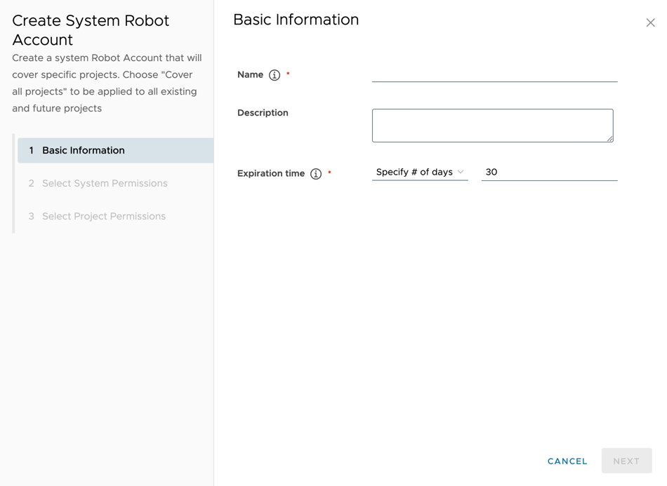

Proposal: Full Permissions For Robot Account

Author: Shijun Sun

Discussion: https://github.com/goharbor/harbor/issues/8723

## Abstract

Expose all the robot permissions on the Harbor UI for users to choose freely

## Background

Currently, the Harbor UI only exposes very limited permissions, but in fact the permissions supported by robot accounts are more than that.
Therefore, it is very inconvenient for those users who want to use the full permissions of a robot account.

## Solution

The Harbor's backend maintains a data dictionary, which lists all the permissions that can be used by robot accounts. And add a new API to return this data dictionary.
Users can choose any permission he wants according to this data dictionary.When the user creates a robot account, the permissions will be verified according to this data dictionary. Any permissions not in the data dictionary will not be allowed.

## Non Goal

1.  Do not expose all the permission. Permissions that may introduce security issues will not be included in the data dictionary
2.  Do not support characters such as * to represent all permissions.

## Personas and User Stories

This section lists the user stories for the different personas interacting with robot account.

* Personas

Robot Account is a System Administrator and Project Administrator operation in Harbor.

* User Stories

1.  As a system admin, I can view/create/edit/delete a system level robot account with project level permissions and system level permissions.
2.  As a system admin, I can view/create/edit/delete a project level robot account with project level permissions.
3.  As a project admin, I can view/create/edit/delete a project level robot account with project level permissions.


## Main Points

1.  Maintain a data dictionary of all permissions that can be used by robot accounts.
2.  Add an API to return this data dictionary.
3.  Implement the UI to display the data dictionary and allow users to choose freely.

## Define the data dictionary

Define the data dictionary for all the permissions that can be used by robot accounts.

```go
type RobotPermission struct {
    Resource string `json:"resource"`
    Actions   []string `json:"actions"`
}

const (
	PeojectPermissions = [...] RobotPermission{
		new RobotPermission(ResourceLabel, [...]Action{ActionCreate, ActionDelete, ActionUpdate}),
		...
    }
	
	SystemPermissions = [...] RobotPermission{
        new RobotPermission(ResourceRegistry, [...]Action{ActionCreate, ActionDelete, ActionUpdate}),
        ...
	}
)
```
```js
const metadata = {
        permissions: {
            system: [
                {
                    resource: 'audit-log',
                    actions: ['list'],
                },
                {
                    resource: 'preheat-instance',
                    actions: ['read', 'list', 'create', 'update', 'delete'],
                },
                {
                    resource: 'project',
                    actions: ['list', 'create'],
                },
                {
                    resource: 'replication-policy',
                    actions: ['read', 'list', 'create', 'update', 'delete'],
                },
                {
                    resource: 'replication',
                    actions: ['read', 'list', 'create', 'update', 'delete'],
                },
                {
                    resource: 'replication-adapter',
                    actions: ['list'],
                },
                {
                    resource: 'registry',
                    actions: ['read', 'list', 'create', 'update', 'delete'],
                },
                {
                    resource: 'scan-all',
                    actions: ['read', 'stop', 'create', 'update'],
                },
                {
                    resource: 'system-volumes',
                    actions: ['read'],
                },
                {
                    resource: 'garbage-collection',
                    actions: ['read', 'stop', 'create', 'update', 'list'],
                },
                {
                    resource: 'purge-audit',
                    actions: ['read', 'stop', 'create', 'update', 'list'],
                },
                {
                    resource: 'jobservice-monitor',
                    actions: ['stop', 'list'],
                },
                {
                    resource: 'tag-retention',
                    actions: ['read', 'list', 'create', 'update', 'delete'],
                },
                {
                    resource: 'scanner',
                    actions: ['read', 'list', 'create', 'update', 'delete'],
                },
                {
                    resource: 'label', // todo list permission needs to confirm
                    actions: ['read', 'create', 'update', 'delete'],
                },
                {
                    resource: 'export-cve',
                    actions: ['read', 'create'],
                },
                {
                    resource: 'security-hub',
                    actions: ['read', 'list'],
                },
                {
                    resource: 'catalog',
                    actions: ['read'],
                },
            ],
            project: [
                {
                    resource: 'label', // todo list permission needs to confirm
                    actions: ['read', 'create', 'update', 'delete', 'list'],
                },
                {
                    resource: 'project',
                    actions: ['read', 'list', 'create', 'update', 'delete'],
                },
                {
                    resource: 'metadata',
                    actions: ['read', 'list', 'create', 'update', 'delete'],
                },
                {
                    resource: 'repository',
                    actions: [
                        'read',
                        'list',
                        'update',
                        'delete',
                        'pull',
                        'push',
                    ],
                },
                {
                    resource: 'artifact',
                    actions: ['read', 'list', 'create', 'delete'],
                },
                {
                    resource: 'scan',
                    actions: ['read', 'create', 'stop'],
                },
                {
                    resource: 'tag',
                    actions: ['list', 'create', 'delete'],
                },
                {
                    resource: 'accessory',
                    actions: ['list'],
                },
                {
                    resource: 'artifact-addition',
                    actions: ['read'],
                },
                {
                    resource: 'artifact-label',
                    actions: ['create', 'delete'],
                },
                {
                    resource: 'scanner',
                    actions: ['create', 'read'],
                },
                {
                    resource: 'preheat-policy',
                    actions: ['read', 'list', 'create', 'update', 'delete'],
                },
                {
                    resource: 'immutable-tag',
                    actions: ['list', 'create', 'update', 'delete'],
                },
                {
                    resource: 'tag-retention',
                    actions: ['read', 'list', 'create', 'update', 'delete'],
                },
                {
                    resource: 'log',
                    actions: ['list'],
                },
                {
                    resource: 'notification-policy',
                    actions: ['read', 'list', 'create', 'update', 'delete'],
                },
            ],
        },
    };
```

### Full permission reference

# Project

| Resource            | list | read | create | delete | update | pull | push | stop |
|---------------------|:----:|:----:|:------:|:------:|:------:|:----:|:----:|:----:|
| label               |  x   |  x   |   x    |   x    |   x    |      |      |      |
| log                 |  x   |      |        |        |        |      |      |      |
| metadata            |  x   |  x   |   x    |   x    |   x    |      |      |      |
| quota               |      |  x   |        |        |        |      |      |      |
| repository          |  x   |  x   |        |   x    |   x    |  x   |  x   |      |
| tag-retention       |  x   |  x   |   x    |   x    |   x    |      |      |      |
| immutable-tag       |  x   |      |   x    |   x    |   x    |      |      |      |
| notification-policy |  x   |  x   |   x    |   x    |   x    |      |      |      |
| scan                |      |  x   |   x    |        |        |      |      |  x   |
| scanner             |      |  x   |   x    |        |        |      |      |      |
| artifact            |  x   |  x   |   x    |   x    |        |      |      |      |
| tag                 |  x   |      |   x    |   x    |        |      |      |      |
| accessory           |  x   |      |        |        |        |      |      |      |
| artifact-addition   |      |  x   |        |        |        |      |      |      |
| artifact-label      |      |      |   x    |   x    |        |      |      |      |
| preheat-policy      |  x   |  x   |   x    |   x    |   x    |      |      |      |
| project             |  x   |  x   |   x    |   x    |   x    |      |      |      |


# System

| Resource            | list | read | create | delete | update | stop |
|---------------------|:----:|:----:|:------:|:------:|:------:|:----:|
| quota               |  x   |  x   |        |        |   x    |      |
| tag-retention       |  x   |  x   |   x    |   x    |   x    |      |
| scanner             |  x   |  x   |   x    |   x    |   x    |      |
| preheat-instance    |  x   |  x   |   x    |   x    |   x    |      |
| audit-log           |  x   |      |        |        |        |      |
| project             |  x   |      |   x    |        |        |      |
| registry            |  x   |  x   |   x    |   x    |   x    |      |
| replication         |  x   |  x   |   x    |   x    |   x    |      |
| garbage-collection  |  x   |  x   |   x    |        |   x    |  x   |
| replication-adapter |  x   |      |        |        |        |      |
| replication-policy  |  x   |  x   |   x    |   x    |   x    |      |
| scan-all            |      |  x   |   x    |        |   x    |  x   |
| system-volumes      |      |  x   |        |        |        |      |
| purge-audit         |  x   |  x   |   x    |        |   x    |  x   |
| jobservice-monitor  |  x   |      |        |        |        |  x   |
| label               |      |  x   |   x    |   x    |   x    |      |
| export-cve          |      |  x   |   x    |        |        |      |
| security-hub        |  x   |  x   |        |        |        |      |
| catalog             |      |  x   |        |        |        |      |


## Relationship between APIs and permissions

System level:
```
1.  get     /health                                              default
2.  get     /search                                              default
3.  get     /statistics                                          default
4.  post    /ldap/ping                                           resource: configuration   |   action: read (disabled )
5.  get     /ldap/users/search                                   resource: ldap-user       |   action: list (disabled )
6.  post    /ldap/users/import                                   resource: ldap-user       |   action: create (disabled )
7.  get     /ldap/groups/search                                  resource: ldap-user       |   action: list (disabled )
8.  get     /internalconfig                                      not allowed
9.  get     /configuration                                       resource: configuration       |   action: read (disabled )
10. put     /configuration                                       resource: configuration       |   action: update (disabled )
11. get     /repositories                                        default   
12. get     /audit-logs                                          resource: audit-log      |   action: list
14. get     /p2p/preheat/providers                               resource: preheat-instance      |   action: list
15. post    /p2p/preheat/instances/ping                          resource: preheat-instance      |   action: read
16. get     /p2p/preheat/instances                               resource: preheat-instance      |   action: list
17. post    /p2p/preheat/instances                               resource: preheat-instance      |   action: create
18. get     /p2p/preheat/instances/{preheat_instance_name}       resource: preheat-instance      |   action: read
19. delete  /p2p/preheat/instances/{preheat_instance_name}       resource: preheat-instance      |   action: delete
20. put     /p2p/preheat/instances/{preheat_instance_name}       resource: preheat-instance      |   action: update
21. get     /usergroups                                          resource:  user-group      |   action: list (disabled )
22. post    /usergroups                                          resource:  user-group      |   action: create (disabled )
23. get     /usergroups/search                                   default
24. get     /usergroups/{group_id}                               resource:  user-group      |   action: read (disabled )
25. put     /usergroups/{group_id}                               resource:  user-group      |   action: update (disabled )
26. put     /usergroups/{group_id}                               resource:  user-group      |   action: delete (disabled )
26. get     /icons/{digest}                                      default
27. get     /robots （system and prject）                         resource:  robot      |   action: list (disabled )
28. post    /robots （system and prject）                         resource:  robot      |   action: create (disabled )
29. get     /robots/{robot_id}（system and prject）               resource:  robot      |   action: read (disabled )
30. put     /robots/{robot_id}（system and prject）               resource:  robot      |   action: update (disabled )
31. delete  /robots/{robot_id}（system and prject）               resource:  robot      |   action: delete (disabled )
32. patch   /robots/{robot_id}（system and prject）               resource:  robot      |   action: update (disabled )
33. get     /projects                                            resource:  project      |   action: list
34. head    /projects                                            default
35. post    /projects                                            resource:  project      |   action: create
36. get     /replication/policies                                resource:  replication-policy      |   action: list
37. post    /replication/policies                                resource:  replication-policy      |   action: create
38. get     /replication/policies/{id}                           resource:  replication-policy      |   action: read
38. delete  /replication/policies/{id}                           resource:  replication-policy      |   action: delete
39. put     /replication/policies/{id}                           resource:  replication-policy      |   action: update
40. get     /replication/executions                              resource:  replication      |   action: list
41. post    /replication/executions                              resource:  replication      |   action: create
42. get     /replication/executions/{id}                         resource:  replication      |   action: read
43. put     /replication/executions/{id}                         resource:  replication      |   action: create
44. get     /replication/executions/{id}/tasks                   resource:  replication      |   action: list
45. get     /replication/executions/{id}/tasks/{task_id}/log     resource:  replication      |   action: read
46. get     /replication/adapters                                resource:  replication-adapter      |   action: list
47. get     /replication/adapterinfos                            resource:  replication-adapter      |   action: list
48. post    /registries                                          resource:  registry      |   action: create
48. get     /registries                                          resource:  registry      |   action: list
49. post    /registries/ping                                     resource:  registry      |   action: read
50. get     /registries/{id}                                     resource:  registry      |   action: read
51. delete  /registries/{id}                                     resource:  registry      |   action: delete
52. put     /registries/{id}                                     resource:  registry      |   action: update
53. get     /registries/{id}/info                           resource:  registry      |   action: read
54. get     /scans/all/metrics                              resource:  scan-all      |   action: read
55. get     /scans/schedule/metrics                         resource:  scan-all      |   action: read
56. get     /systeminfo                                     default
57. get     /systeminfo/volumes                             resource:  system-volumes     |   action: read
58. get     /systeminfo/getcert                             default
59. post    /system/oidc/ping                               resource:  configuration     |   action: update
60. get     /system/gc                                      resource:  garbage-collection     |   action: list
61. get     /system/gc/{gc_id}                              resource:  garbage-collection     |   action: read
62. put     /system/gc/{gc_id}                              resource:  garbage-collection     |   action: stop
63. get     /system/gc/{gc_id}/log                          resource:  garbage-collection     |   action: read
64. get     /system/gc/schedule                             resource:  garbage-collection     |   action: read
65. post    /system/gc/schedule                             resource:  garbage-collection     |   action: create
66. put     /system/gc/schedule                             resource:  garbage-collection     |   action: update
67. get     /system/purgeaudit                              resource:  purge-audit     |   action: list
68. get     /system/purgeaudit/{purge_id}                   resource:  purge-audit     |   action: read
69. put     /system/purgeaudit/{purge_id}                   resource:  purge-audit     |   action: stop
70. get     /system/purgeaudit/{purge_id}/log               resource:  purge-audit     |   action: read
71. get     /system/purgeaudit/schedule                     resource:  purge-audit     |   action: read
72. post    /system/purgeaudit/schedule                     resource:  purge-audit     |   action: create
73. put     /system/purgeaudit/schedule                     resource:  purge-audit     |   action: update
74. get     /system/CVEAllowlist                            default
75. put     /system/CVEAllowlist                            resource:  configuration     |   action: update (disabled )
76. get     /system/scanAll/schedule                        default
77. put     /system/scanAll/schedule                        resource:  scan-all      |   action: update
78. post    /system/scanAll/schedule                        resource:  scan-all      |   action: create
79. post    /system/scanAll/stop                            resource:  scan-all      |   action: stop
80. get     /jobservice/pools                               resource:  jobservice-monitor      |   action: list
81. get     /jobservice/pools/{pool_id}/workers             resource:  jobservice-monitor      |   action: list
82. put     /jobservice/jobs/{job_id}                       resource:  jobservice-monitor      |   action: stop
82. get     /jobservice/jobs/{job_id}/log                   resource:  jobservice-monitor      |   action: list
83. get     /jobservice/queues                              resource:  jobservice-monitor      |   action: list
84. put     /jobservice/queues/{job_type}                   resource:  jobservice-monitor      |   action: stop
85. get     /schedules                                      default
86. get     /schedules/{job_type}/paused                    default
87. get     /ping                                           default
88. get     /retentions/metadatas                           default
89. post    /retentions                                     resource:  tag-retention      |   action: create
90. get     /retentions/{id}                                resource:  tag-retention      |   action: read
91. put     /retentions/{id}                                resource:  tag-retention      |   action: update
92. delete  /retentions/{id}                                resource:  tag-retention      |   action: delete
93. post    /retentions/{id}/executions                     resource:  tag-retention      |   action: update
94. get     /retentions/{id}/executions                     resource:  tag-retention      |   action: list
95. patch   /retentions/{id}/executions/{eid}               resource:  tag-retention      |   action: update
96. get     /retentions/{id}/executions/{eid}/tasks         resource:  tag-retention      |   action: list
97. get     /retentions/{id}/executions/{eid}/tasks/{tid}   resource:  tag-retention      |   action: read
98. get     /scanners                                       resource:  scanner     |   action: list
99. post    /scanners                                       resource:  scanner     |   action: create
100. post   /scanners/ping                                  resource:  scanner     |   action: read
101. get    /scanners/{registration_id}                     resource:  scanner     |   action: read
102. put    /scanners/{registration_id}                     resource:  scanner     |   action: update
102. delete /scanners/{registration_id}                     resource:  scanner     |   action: delete
103. patch  /scanners/{registration_id}                     resource:  scanner     |   action: update
104. get    /scanners/{registration_id}/metadata            resource:  scanner     |   action: read
105. get    /users                                          resource:  user     |   action: list
106. post   /users                                          resource:  user     |   action: create
107. get    /users/current                                  not allowed
108. get    /users/search                                   default
109. get    /users/{user_id}                                resource:  user     |   action: read
110. put    /users/{user_id}                                resource:  user     |   action: update
111. delete /users/{user_id}                                resource:  user     |   action: delete
112. put    /users/{user_id}/sysadmin                       resource:  user     |   action: update
113. put    /users/{user_id}/password                       resource:  user     |   action: update
114. get    /users/current/permissions                      default
115. put    /users/{user_id}/cli_secret                     resource:  user     |   action: update
116. get    /labels  (system and project)                   default
117. post   /labels  (system and project)                   resource:  label     |   action: create
118. get    /labels/{label_id}  (system and project)        resource:  label     |   action: read
119. put    /labels/{label_id}  (system and project)        resource:  label     |   action: update
120. delete /labels/{label_id}  (system and project)        resource:  label     |   action: delete
121. post   /export/cve                                     resource:  export-cve     |   action: create
122. get    /export/cve/execution/{execution_id}            resource:  export-cve     |   action: read
123. get    /export/cve/executions                          default
124. get    /export/cve/download/{execution_id}             resource:  export-cve     |   action: read
125. get    /security/summary                               resource:  security-hub     |   action: read
126. get    /security/vul                                   resource:  security-hub     |   action: list
127. post   /c/login                                        not allowed
128. get    /c/log_out                                      default
// for docker login
129. get    /service/token                                  default
132. get    /v2/_catalog                                    resource:  catalog     |   action: read


```
Project level:
```
1. get     /projects/{project_name}/logs                  resource: log      |   action: list
4. get     /projects/{project_name_or_id}                 resource:  project      |   action: read
5. put     /projects/{project_name_or_id}                 resource:  project      |   action: update
6. delete  /projects/{project_name_or_id}                 resource:  project      |   action: delete
7. get     /projects/{project_name_or_id}/_deletable      resource:  project      |   action: delete
8. get     /projects/{project_name_or_id}/members         resource: member       |   action: list (disabled )
9. post    /projects/{project_name_or_id}/members         resource: member       |   action: create (disabled )
10. get    /projects/{project_name_or_id}/members/{mid}   resource: member       |   action: read (disabled )
11. put    /projects/{project_name_or_id}/members/{mid}   resource: member       |   action: update (disabled )
12. delete /projects/{project_name_or_id}/members/{mid}   resource: member       |   action: delete (disabled )
13. get    /projects/{project_name_or_id}/metadatas       resource: metadata        |   action: list
14. post   /projects/{project_name_or_id}/metadatas       resource: metadata       |   action: create
15. get    /projects/{project_name_or_id}/metadatas/{meta_name}       resource: metadata       |   action: read
16. put    /projects/{project_name_or_id}/metadatas/{meta_name}       resource: metadata       |   action: update
17. delete /projects/{project_name_or_id}/metadatas/{meta_name}       resource: metadata       |   action: delete
18. get    /projects/{project_name}/repositories                      resource: repository       |   action: list
19. get    /projects/{project_name}/repositories/{repository_name}    resource: repository       |   action: read
20. put    /projects/{project_name}/repositories/{repository_name}    resource: repository       |   action: update
21. delete /projects/{project_name}/repositories/{repository_name}    resource: repository       |   action: delete
22. get    /projects/{project_name}/repositories/{repository_name}/artifacts    resource: artifact       |   action: list
23. post   /projects/{project_name}/repositories/{repository_name}/artifacts    resource: artifact       |   action: create
24. get    /projects/{project_name}/repositories/{repository_name}/artifacts/{reference}                             resource: artifact       |   action: read
25. delete /projects/{project_name}/repositories/{repository_name}/artifacts/{reference}                             resource: artifact       |   action: delete
26. post   /projects/{project_name}/repositories/{repository_name}/artifacts/{reference}/scan                        resource: scan       |   action: create
27. post   /projects/{project_name}/repositories/{repository_name}/artifacts/{reference}/scan/stop                   resource: scan       |   action: stop
28. get    /projects/{project_name}/repositories/{repository_name}/artifacts/{reference}/scan/{report_id}/log        resource: scan       |   action: read
29. post   /projects/{project_name}/repositories/{repository_name}/artifacts/{reference}/tags                        resource: tag       |   action: create
30. get    /projects/{project_name}/repositories/{repository_name}/artifacts/{reference}/tags                        resource: tag       |   action: list
31. delete /projects/{project_name}/repositories/{repository_name}/artifacts/{reference}/tags/{tag_name}             resource: tag       |   action: delete
32. get    /projects/{project_name}/repositories/{repository_name}/artifacts/{reference}/accessories                 resource: accessory       |   action: list
33. get    /projects/{project_name}/repositories/{repository_name}/artifacts/{reference}/additions/vulnerabilities   resource: artifact-addition       |   action: read
34. get    /projects/{project_name}/repositories/{repository_name}/artifacts/{reference}/additions/{addition}        resource: artifact-addition       |   action: read
35. post   /projects/{project_name}/repositories/{repository_name}/artifacts/{reference}/labels                      resource: artifact-label       |   action: create
36. delete /projects/{project_name}/repositories/{repository_name}/artifacts/{reference}/labels/{label_id}           resource: artifact-label       |   action: delete
37. get    /projects/{project_name_or_id}/scanner                  resource: scanner      |   action: read
38. put    /projects/{project_name_or_id}/scanner                  resource: scanner      |   action: create
39. get    /projects/{project_name_or_id}/scanner/candidates       resource: scanner      |   action: create
40. post   /projects/{project_name}/preheat/policies               resource: preheat-policy      |   action: create
41. get    /projects/{project_name}/preheat/policies               resource: preheat-policy      |   action: list
42. get    /projects/{project_name}/preheat/policies/{preheat_policy_name}             resource: preheat-policy      |   action: read
43. put    /projects/{project_name}/preheat/policies/{preheat_policy_name}             resource: preheat-policy      |   action: update
44. post   /projects/{project_name}/preheat/policies/{preheat_policy_name}             resource: preheat-policy      |   action: read
45. delete /projects/{project_name}/preheat/policies/{preheat_policy_name}             resource: preheat-policy      |   action: delete
46. get    /projects/{project_name}/preheat/policies/{preheat_policy_name}/executions/{execution_id}             resource: preheat-policy      |   action: read
47. patch  /projects/{project_name}/preheat/policies/{preheat_policy_name}/executions/{execution_id}             resource: preheat-policy      |   action: update
48. get    /projects/{project_name}/preheat/policies/{preheat_policy_name}/executions/{execution_id}/tasks       resource: preheat-policy      |   action: list
49. get    /projects/{project_name}/preheat/policies/{preheat_policy_name}/executions/{execution_id}/tasks/{task_id}/logs   resource: preheat-policy      |   action: read
50. get    /projects/{project_name}/preheat/providers             resource: preheat-policy      |   action: list
51. get    /projects/{project_name_or_id}/robots                  resource: robot      |   action: list
52. post   /projects/{project_name_or_id}/robots                  resource: robot      |   action: create
53. get    /projects/{project_name_or_id}/robots/{robot_id}       resource: robot      |   action: read
54. put    /projects/{project_name_or_id}/robots/{robot_id}       resource: robot      |   action: update
55. delete /projects/{project_name_or_id}/robots/{robot_id}       resource: robot      |   action: delete
56. get    /projects/{project_name_or_id}/immutabletagrules'      resource: immutable-tag      |   action: list
57. post   /projects/{project_name_or_id}/immutabletagrules'      resource: immutable-tag      |   action: create
58. put    /projects/{project_name_or_id}/immutabletagrules/{immutable_rule_id}   resource: immutable-tag      |   action: update
59. delete /projects/{project_name_or_id}/immutabletagrules/{immutable_rule_id}   resource: immutable-tag      |   action: delete
60. get    /projects/{project_name_or_id}/webhook/policies   resource: notification-policy      |   action: list
61. post   /projects/{project_name_or_id}/webhook/policies   resource: notification-policy      |   action: create
62. get    /projects/{project_name_or_id}/webhook/policies/{webhook_policy_id}      resource: notification-policy   |   action: read
63. put    /projects/{project_name_or_id}/webhook/policies/{webhook_policy_id}      resource: notification-policy   |   action: update
64. delete /projects/{project_name_or_id}/webhook/policies/{webhook_policy_id}      resource: notification-policy   |   action: delete
65. get    /projects/{project_name_or_id}/webhook/policies/{webhook_policy_id}/executions                                     resource: notification-policy   |   action: read
66. get    /projects/{project_name_or_id}/webhook/policies/{webhook_policy_id}/executions/{execution_id}/tasks                resource: notification-policy   |   action: read
67. get    /projects/{project_name_or_id}/webhook/policies/{webhook_policy_id}/executions/{execution_id}/tasks/{task_id}/log  resource: notification-policy   |   action: read
68. get    /projects/{project_name_or_id}/webhook/lasttrigger      resource: notification-policy   |   action: read
69. get    /projects/{project_name_or_id}/webhook/jobs             resource: notification-policy   |   action: list
70. get    /projects/{project_name_or_id}/webhook/events           resource: notification-policy   |   action: read
// for docker pull and push
71. post   /v2/{project_name}/{repo_name}/blobs/uploads            resource:  registry     |   action: push
72. get    /v2/{project_name}/{repo_name}/referrers/{digest}       resource:  reference     |   action: read
73. get    /v2/{project_name}/{repo_name}/manifests/{reference}    default

```

## API

Entries:

1.  API path:  `api/v2.0/permissions`
 *   GET: return the data dictionary of all permissions that can be used by robot accounts. Only project admin and system admin can call this API.
     
 *  For system admins, it returns both the system permissions and the project permissions
```
GET api/v2.0/permissions

STATUS       : 200 ok
HEADERS      :
   Connection: keep-alive
   Content-Length: 0
   X-Request-Id: 92e7d4be-0291-4c50-92bd-889d71e1ec78
BODY         :

{
   permissions: {
     project: [
       {
         resource: "label",
         actions: ["create", "delete", "update"]
       }
       ...
     ],
     system: [
       {
         resource: "registry",
         actions: ["create", "delete", "update"]
       }
       ...
     ]   
      
   }
}

```

*  For project admins, it only returns the project permission

```
GET api/v2.0/permissions

STATUS       : 200 ok
HEADERS      :
   Connection: keep-alive
   Content-Length: 0
   X-Request-Id: 92e7d4be-0291-4c50-92bd-889d71e1ec78
BODY         :

{
   permissions: {
     project: [
       {
         resource: "label",
         actions: ["create", "delete", "update"]
       }
       ...
     ]   
   }
}

```


## UI flow

1. Create or update a project robot


2. Create or update a system robot



### To Be Discussed

1. Consider permission combinations.
2. Consider the UI display(translation) of the permission.

## Security Concern

need to check every permission whether it will introduce security issues.

* for example: create user, create robot account, etc.
