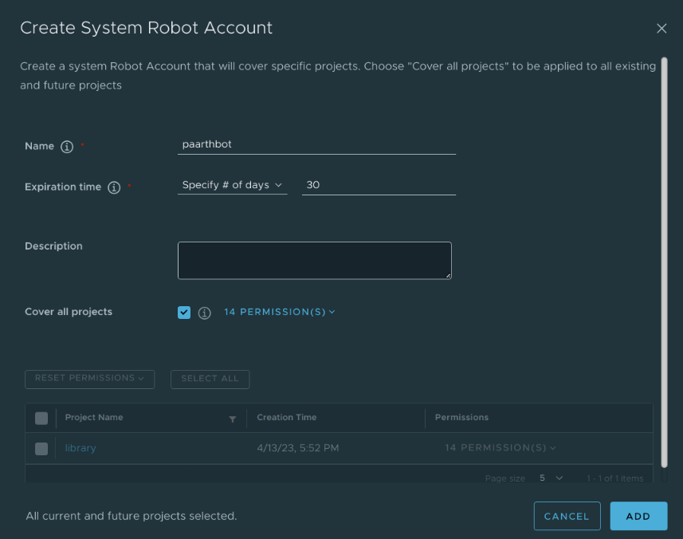
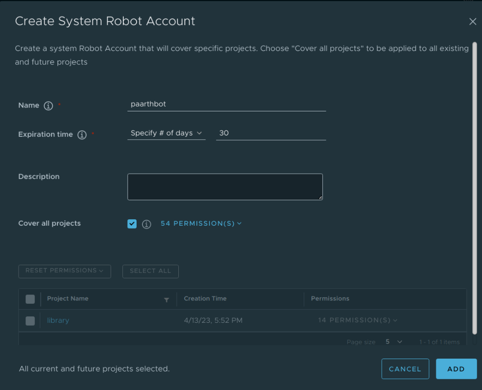
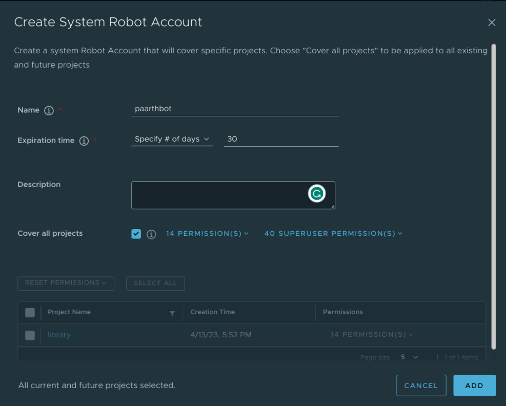

Proposal: Enable full Harbor API access to Robot accounts
Author: Paarth Agarwal

Discussion: [goharbor/harbor#8723](https://github.com/goharbor/harbor/issues/8723) [goharbor/harbor#17703](https://github.com/goharbor/harbor/issues/17703) [goharbor/harbor#14145issuecomment](https://github.com/goharbor/harbor/issues/14145#issuecomment-781006533)

## Abstract

Robot accounts should be allowed to access the full Harbor API.

## Background

As discussed in [goharbor/harbor#8723](https://github.com/goharbor/harbor/issues/8723), the support for users to provide full Harbor API access to Robot accounts through UI has been desired by the Harbor user community for a long time now. Users have to manually enable permissions through backend for Robot accounts which is time consuming.

## Goals

- Implement a way to configure Robot account permissions from the UI itself.

- Fully document the new functionality with examples and usecases how to setup Harbor Robot accounts with full or managed access to Harbor.

- Setup necceary tests.

## Implementation

As of now the Harbor UI looks like this :



As of now we have 14 permissions accessible through UI.
For complete access we can about in two ways:

1. Add new permissions with the existing permissions. Assuming we add about 40 new permissions we display total of 54 permissions to the users.



2. Add new permissions separately and labelling them as superuser permissions.



### Psuedo-code Snippet

Some sample code snippets for new permissions in system-robot-utils.ts

```go
export enum Action {
    PUSH = 'push',
    PULL = 'pull',
    READ = 'read',
    CREATE = 'create',
    LIST = 'list',
    STOP = 'stop',
    DELETE = 'delete'
}
export const NAMESPACE_ALL_PROJECTS: string = '*';
export const INITIAL_ACCESSES: FrontAccess[] = [
    {
        "resource": "repository",
        "action": "push",
        "checked": true
    },
    {
        "resource": "repository",
        "action": "pull",
        "checked": true
    },
    {
        "resource": "artifact",
        "action": "delete",
        "checked": true
    },
    {
        "resource": "helm-chart",
        "action": "read",
        "checked": true
    },
    {
        "resource": "helm-chart-version",
        "action": "create",
        "checked": true
    },
    {
        "resource": "helm-chart-version",
        "action": "delete",
        "checked": true
    },
    {
        "resource": "tag",
        "action": "create",
        "checked": true
    },
    {
        "resource": "tag",
        "action": "delete",
        "checked": true
    },
    {
        "resource": "artifact-label",
        "action": "create",
        "checked": true
    },
    {
        "resource": "artifact-label",
        "action": "delete",
        "checked": true
    },
```

While this is not the code for the new permissions but it'll be very similar to it.

### Psuedo-code Snippet for test

Some sample code snippets for new permissions in tests/resources/Harbor-Pages/Robot_Account.robot

```go
Create A Random Permission Item List
    ${permission_item_all_list}=  Create List  Push Artifact
    ...                                    Pull Artifact
    ...                                    Delete Artifact
    ...                                    Read Helm Chart
    ...                                    Create Helm Chart Version
    ...                                    Delete Helm Chart Version
    ...                                    Create Tag
    ...                                    Delete Tag
    ...                                    Create Artifact label
    ...                                    Create Scan
  //Add new permission names here
```

The above snippet can also be modified as per the mentor want.
