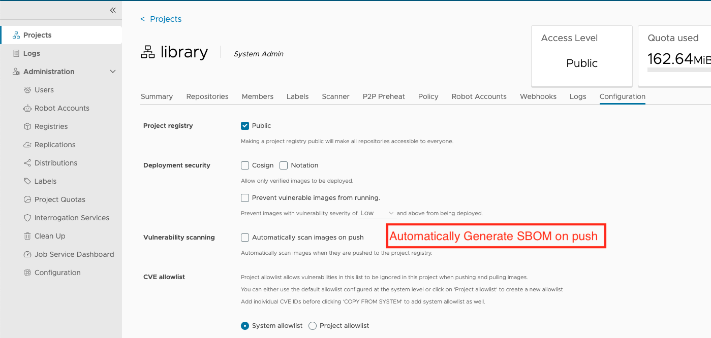
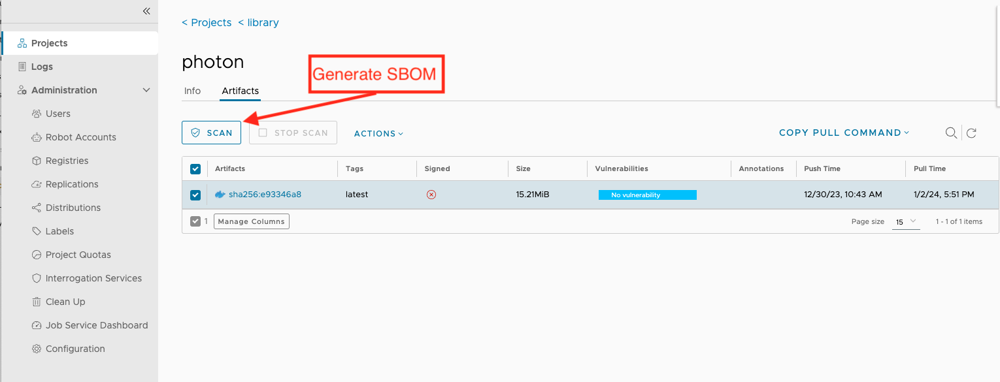
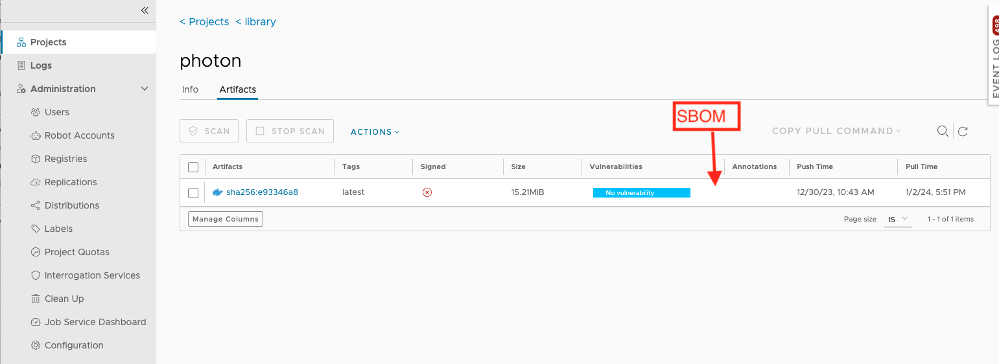
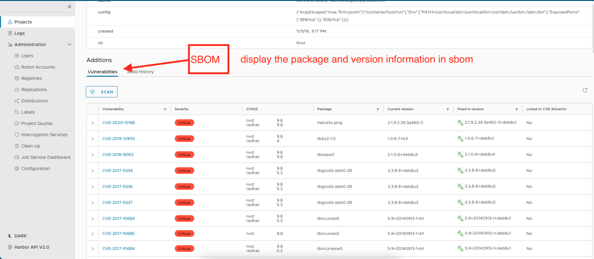

# Proposal: SBOM Generation and Scan

Author: stonezdj

Discussion:
* https://github.com/goharbor/harbor/issues/16397
* https://github.com/goharbor/harbor/issues/16186

## Abstract
Software Bill of Materials(SBOM) is a formal representation of the software components and dependencies used in a software project. It provides a comprehensive inventory of software components, their versions, and their relationships, which help organizations to manage their software supply chain risks more effectively. Harbor, as a cloud native registry, naturally manages OCI artifacts, integrate the SBOM into harbor can significantly enhance its functionality, providing users with a more comprehensive and transparent view of their software while also ensuring increased security and compliance.

## Background

A Software Bill of Materials (SBOM) is a complete, formally structured list of components, libraries, and modules that are required to build (i.e. compile and link) a given piece of software and the supply chain relationships between them. These components can be open source or proprietary, free or paid, and widely available or restricted access.
From NTIA’s SBOM FAQ: <https://www.ntia.doc.gov/files/ntia/publications/ntia_sbom_faq_-_april_15_draft.pdf>

### Industry Standards


Currently, there are two widely recognized vendor-neutral standards, SPDX from the Linux Foundation and CycloneDX from the OWASP Foundation. Additionally, there are other standards defined by the SBOM generator, including syft and such more.


- [SPDX](https://spdx.dev/)
- [CycloneDX](https://cyclonedx.org/)


### Tools


There are several open source well-known tools that can generate SBOMs from container images or scan vulnerabilities from SBOMs.


Generate SBOM


- [Syft](https://github.com/anchore/syft)
- [Tern](https://github.com/tern-tools/tern)
- [Trivy](https://github.com/aquasecurity/trivy)
- [SBOM-tool](https://github.com/microsoft/sbom-tool)
- [Bom](https://github.com/kubernetes-sigs/bom)


Scan SBOM


- [Trivy](https://github.com/aquasecurity/trivy)
- [Grype](https://github.com/anchore/grype)
- [Bomber](https://github.com/devops-kung-fu/bomber)

## Goals


- Generate SBOM for artifacts by 3rd tools and stores the SBOM as accessory in Harbor.
- No limitation of the SBOM generation tool, provide the flexible ways to attach the SBOM.
  - **Scanner Mode**: Extend the spec of [pluggable scanner](<https://github.com/goharbor/pluggable-scanner-spec>). The scanner provides additional SBOM generation and scanning capabilities. Harbor is responsible for sending SBOM generation or scanning requests to the scanner. When a request is received, the scanner retrieves the subject artifact and generates the SBOM. 
- The SBOM will be listed as the accessory of the artifact in the Harbor.
- The SBOM can be downloaded from the Harbor UI.


## Personas

1. The system administrator.
2. The project administrator.
3. The project maintainer.
4. The authorized users.

## User stories

1. As the system administrator, I want to add a scanner to Harbor which has the ability of generate and scan SBOM. 
2. As the project administrator, I want to add a custom scanner instead of system default one to Harbor which has the ability of generate and scan SBOM.
3. As the system/project administrator, I want to enable the SBOM generation automatically for a project.
4. As the project maintainer, I want to trigger the generate SBOM operation manually.
5. As the authorized user with read permission, I want to view the SBOM accessories if I can see the sbom information. and can download it to local. 
6. As the authorized user with delete permission, I want to delete the SBOM accessories if I can delete the subject artifact.

## Non Goals
   Current implementation doens't handle the sbom generated by client mode, it means that the external scanner generate the sbom and upload it to the Harbor. the Harbor only display it as an artifact accessory, Harbor doesn't display its packages and version information in detail, the Harbor only support to display the SBOM generated by Harbor (Scanner Mode).

   For image index/list type, the scan request will generate the SBOM for each image in the index/list respectively, the child image of the image index/list's SBOMs will not be merged.

## Compatibility

The existing API should be compatible with the previous version. it means that the previous API, plugable scanner spec 1.0 should still work if the scanner implements the spec 1.0. but the SBOM feature will not be available for the previous scanner.
For each project, the scanner API (/api/v2.0/projects/<project_id>/scanner) could retrieve its scanner's UUID, and the metadata API(/api/v2.0/scanners/<scanner_UUID>/metadata), for each capability, it has a field named `type`, if type is `sbom` means it could generate SBOM, if it is `vulnerability` means it could scan vulnerability. by default the scanner should support to scan vulnerability if it implement the plugable scanner spec 1.1. If the current scanner doesn't have the sbom type, the SBOM feature such as generate SBOM/stop generate SBOM button should not be available for the project.

## Implementation

### Database Schema Changes

Add a new table sbom_report table, it stores the SBOM report summary information generated by the scanner. the table schema is as following:

``` 
CREATE TABLE IF NOT EXISTS sbom_report
(
    id SERIAL PRIMARY KEY NOT NULL,
    uuid VARCHAR(64) UNIQUE NOT NULL,
    artifact_id INT NOT NULL,
    registration_uuid VARCHAR(64) NOT NULL,
    mime_type VARCHAR(256) NOT NULL,
    media_type VARCHAR(256) NOT NULL,
    report JSON,
    UNIQUE(artifact_id, registration_uuid, mime_type, media_type)
);
```
The sbom_report table use the artifact_id, registration_uuid, mime_type and media_type as the unique key. because 
the sbom is an accessory of the artifact, it is stored as artifact accessory for the subject artifact, it has fixed project and repository, if two artifact have same digest, they generate each sbom accessory respectively. it is different with the vulnerability scan. 

### Adatper API change
The adapter need to implement the following APIs to support the SBOM generation and scan.

1. Update the metadata API to add the capability to generate SBOM 
The /api/v1/metadata API should return the following information if it support to generate SBOM
Request Method:
```
GET /api/v1/metadata
```
Response:
```
{
    "scanner": {
        "name": "Trivy",
        "vendor": "Aqua Security",
        "version": "x.x.x"
    },
    "capabilities": [
        {
            "type": "vulnerability",
            "consumes_mime_types": [
                "application/vnd.oci.image.manifest.v1+json",
                "application/vnd.docker.distribution.manifest.v2+json"
            ],
            "produces_mime_types": [
                "application/vnd.security.vulnerability.report; version=1.1",
            ]
        },
        {
            "type": "sbom",
            "consumes_mime_types": [
                "application/vnd.oci.image.manifest.v1+json",
                "application/vnd.docker.distribution.manifest.v2+json"
            ],
            "produces_mime_types": [
                "application/vnd.security.sbom.report+json; version=1.0"
            ]
            "additional_attributes": {
                "sbom_media_types": ["application/spdx+json","application/vnd.cyclonedx+json"]
            }
        }
    ]
}
```
If the adapter does not support to generate sbom, the produces_mime_types should not include the SBOM mime type.
In the header of the response, it should include the content type 
```
Content-Type: application/vnd.scanner.adapter.metadata+json; version=1.0

Content-Type: application/vnd.scanner.adapter.metadata+json; version=1.1

```

If the type is `sbom`, the additional_attributes should has the `sbom_media_types`, it indicate the supported media type of the SBOM report, if the scanner support to generate spdx, then the "application/spdx+json" should be included in the `sbom_media_types`.


2. Update the scan API to add the capability to generate SBOM (adapter)
The ScanRequest send to /api/v1/scan should include the following information when it requires to generate SBOM

Request Method:
```
POST /api/v1/scan
```
Request Body:
```
{
    "registry": {
        "url":"https://harbor.example.com",
        "authorization": "Basic xxxxxxx"
    }
    "artifact": {
        "repository": "library/nginx",
        "reference": "latest"
    },
    "enabled_capabilities": [{
        "type": "sbom" 
        "produces_mime_types": [
            "application/vnd.security.sbom.report+json; version=1.0"
        ],
        "parameters": {
            "sbom_media_types": ["application/spdx+json"]
        }
    }]
}
```
In the enabled_capabilities, it is an array of object, for each element the type field is mandatory, it indicates the type of the scan request. the produces_mime_types and parameters are optional.

The parameters.sbom_media_types should be a string array which indicate the media_types of the SBOM report. the `sbom_media_types` should be in the same list of the sbom_media_types in the scanner_registration table. if the sbom_media_types is not in it, the scanner adapter should return 400 to the client.

The scanner accept this request and send back the scan request id in the body of the response, the scan request id is the UUID of the request, it is only used in the scanner scope. The response body should be like this:
```
{
    "id": "3fa85f64-5717-4562-b3fc-2c963f66afa6"
}
```

In the Harbor job service, the scan job should be updated to support different requests includes SBOM and vulnerability.

3. Update the report API to retrieve SBOM or vulnerability report.

The /api/v1/scan/{scan_request_id}/report API should return the following information if it support to generate SBOM
Request Method:
```
GET /api/v1/scan/{scan_request_id}/report?sbom_media_type=application/spdx+json  (url should be encoded)
```
Request Header should include the Accept Header, if the Accept Header is not provided, it will return 400 to the client. 
The Accept Header should match the produced_mime_types in the scan request.

If the scan request type is vulnerability, the request URL should be 
```
GET /api/v1/scan/{scan_request_id}/report
```

the Accept header should be one of the following

```
Accept: application/vnd.scanner.adapter.vuln.report.harbor+json; version=1.0
or
Accept: application/vnd.security.vulnerability.report; version=1.1
or
Accept: application/vnd.scanner.adapter.vuln.report.raw

```
If the request is SBOM, the request URL should be
```
GET /api/v1/scan/{scan_request_id}/report?sbom_media_type=application/spdx+json  (url should be encoded)
```
and the Accept header should be: 
`Accept: application/vnd.security.sbom.report+json; version=1.0`
For different scan request, the Accpet header should be different.

Response:
```
{
    "generated_at": "2021-10-11T07:20:50.52Z",
    "artifact": {
        "repository": "library/nginx",
        "reference": "latest"
    },
    "scanner": {
        "name": "Trivy",
        "vendor": "Aqua Security",
        "version": "x.x.x"
    },
    "media_type": "application/spdx+json | application/vnd.cyclonedx+json",
    "sbom": {
        < the sbom content >
    }
}
```

If the sbom_media_type is not provided, the scanner adapter should return 400 to the client. if the request report is not available, it should return 404 to the client. if the request is not ready, it should return 404 to the client. the client will retry and wait until timeout.

### Harbor API change


1. Add a project level configuration item auto_gen_sbom to enable auto generate SBOM on image push, the default value is false.

2. The default SBOM media_type for scanner is hardcode to `application/spdx+json`, the media_type is stored in sbom_report table as a column.

3. Update existing scan API to allow to generate SBOM
Request Method:
```
POST /api/v2.0/projects/<projectname>/repositories/<repository>/artifacts/<digest>/scan
```

Request Body:
```
{
    "scan_type":"sbom"
}
```

When the scan_type is empty or `vulnerability`, the scan type should be vulnerability scan, if the scan_type is `sbom`, the scan type should be SBOM generation. The scan job will be created and executed asynchronously. it will use the default scanner to scan the artifact. if the scanner is not available, the job will be failed.

If the scan request is accepted, it will return 202 to the client, request body is empty.

4. Update the existing stop scan API to support stop SBOM generation
Request Method:
```
POST /api/v2.0/projects/<projectname>/repositories/<repository>/artifacts/<digest>/scan/stop
``` 

Request Body:
```
{
    "scan_type":"sbom"
}
```
If the scan_type is empty, it is default to "vulnerability". it will query the execution table to find the scan job with the same artifact digest and the scan type. if the job is running, it will stop the job.


5. Update existing scan job service, add support to generate SBOM for an artifact, update the existing job service in pkg/scan/job.go to support SBOM generate in the request parameter. for a generate SBOM report request, the job service should:

    1. Delete the previous SBOM report generated with the same scanner if exist. include the information in the table sbom_report and the artifact accessory in the OCI registry. it gets the `sbom_digest` and `sbom_repository` information from the sbom_report table's report column, if both exist, then it deletes the SBOM accessory in the OCI registry. 
    1. Parse the SBOM report and push the the SBOM to the OCI registry as an artifact accessory. its mime type should be "application/vnd.goharbor.harbor.sbom.v1"
    1. Store the SBOM digest information into the table sbom_report.

    The Harbor job service stores the SBOM digest information into the database. the sbom_report table's report column is updated with the following content:
    ```
    { 
        "sbom_digest":"sha256:51a41cec9de9d62ee60e206f5a8a615a028a65653e45539990867417cb486285",
        "sbom_repository":"library/nginx"
    }
    ```
    If there is a SBOM report exists for the same scanner, it should be replaced. 

    The generic process of the SBOM generation and scan is as following: 

   1. Parse scan request job parameters
   2. Select the scanner to scan the artifact
   3. Generate required secret to access the registry and repository, send the scan request to the scanner adapter
   4. If the scan request is accepted, it will return 202 to the client. the client will receive a request id in the response body.
   5. The job service query the scan report from the scanner adapter by the given request id, until all required reports are ready. it also have a timeout to avoid the job to be blocked too long.
   6. Parse the report and store the report information.

6. Update existing list artifact API to support list artifact with_sbom_overview, if with_sbom_overview is true and the sbom information is in the sbom_report, the sbom_overview data should be provided. 
```
[
    {
        "digest": "sha256:1d417d2b74017139bb2bd2a9ff7f6be0c6d9ee25452d70190e3508df8a6a1586",
        "icon": "sha256:0048162a053eef4d4ce3fe7518615bef084403614f8bca43b40ae2e762e11e06",
        "id": 53,
        "labels": null,
        "manifest_media_type": "application/vnd.docker.distribution.manifest.v2+json",
        "media_type": "application/vnd.docker.container.image.v1+json",
        "project_id": 1,
        "pull_time": "2024-01-30T08:08:00.508Z",
        "push_time": "2024-01-30T06:10:44.848Z",
        "repository_id": 22,
        ...
        "sbom_overview": {
            "application/vnd.security.sbom.report+json; version=1.0": {
                "duration": 4,
                "end_time": "2024-01-30T08:07:56.000Z",
                "report_id": "1a6f49a5-17ea-49b4-94ff-f38fc80cc0c8",
                "scan_status": "Stopped",
                "start_time": "2024-01-30T08:07:52.000Z"
                "sbom_digest": "sha256:51a41cec9de9d62ee60e206f5a8a615a028a65653e45539990867417cb486285",
            }
        },
        ...
        "size": 7028041,
        "tags": null,
        "type": "IMAGE"
    }
]
```
In the list artifact page, add SBOM overview column to display the sbom_overview information of the artifact, it retrieves the sbom_report table and get the digest of the artifact accessory, if the artifact accessory exists, it returns the SBOM status information. If the report in sbom_report has no record related to this artifact's SBOM, the sbom_overview keeps empty or fallback to the query result of the artifact accessory for this artifact.

7. Add an API to retrieve the SBOM content for the SBOM accessory.
Request Method:
```
GET /api/v2.0/projects/<projectname>/repositories/<repository>/artifacts/<digest>/additions/sbom
```
Response:
```
{
    "spdxVersion": "SPDX-2.3",
    "dataLicense": "CC0-1.0",
    "SPDXID": "SPDXRef-DOCUMENT",
    "name": "alpine:latest",
    "documentNamespace": "<http://aquasecurity.github.io/trivy/container_image/alpine:latest-24fab3cb-05fa-479b-b3b7-f76151354cc3>",
    "creationInfo":{
      "licenseListVersion": "",
      "creators": [
        "Organization: aquasecurity",
        "Tool: trivy-0.44.1"
      ],
      "created": "2023-09-22T07:41:04Z"
    },
    "packages": [
        {
          "name": "alpine",
          "SPDXID": "SPDXRef-OperatingSystem-68bf9b9d283c287a",
          "versionInfo": "3.18.3",
          "downloadLocation": "NONE",
          "copyrightText": "",
          "primaryPackagePurpose": "OPERATING-SYSTEM"
        },
        ...
    ]
    ...
    }
   ...
}
```

The additions API should be updated to support the SBOM report. the artifact digest is the SBOM accessory digest and the actual sbom content is stored in the OCI registry as a layer, it requires to register a sbom processor for the media type "application/vnd.goharbor.harbor.sbom.v1". the processor should implement the method of AbstractAddition(), in this method it parse the first layer of the artifact accessory, and return the SBOM content in the response body.

Because the end user could upload the SBOM to an artifact, and also Harbor itself could generate SBOM for an existing artifact. When all projects enabled auto generated sbom on push, the number of SBOMs is approximately equal to the number of artifacts. for performance consideration, the SBOM should be stored in the OCI registry, not in the postgres database. Harbor UI only displays the SBOM report generated in Harbor. 

Given a artifact digest, if the SBOM report is unavailable, it returns http code 404 to the client.

8. In the artifact detail information page artifact accessory, add UI tab to display the SBOM information of the SBOM accessory, it only supports the SBOM generated by Harbor.
 

### SBOM Generation

   The SBOM generation is triggered by the following scenarios:
    1. The user trigger the SBOM generation by calling the SBOM API
    2. The user push the artifact to the repository and the scanner policy is configured to trigger the SBOM generation when the artifact is pushed to the repository.

### Lifecycle Management
    
The SBOM is stored the OCI registry, it should: 

1. It can be replicated by Harbor replication, except missing SBOM summary information, the target Harbor should display the same SBOM detail information. when a SBOM artifact accessory is replicated from Harbor A to Harbor B, then list the artifact in Harbor B, the SBOM accessory should be displayed in the artifact's list page. because the sbom_report in Harbor B has no sbom report associate with the artifact. then it will fallback to the query result of artifact accessory for this artifact, the artifact accessory query API is
```
GET /api/v2.0/projects/<project_name>/repositories/<repository_name>/artifacts/<digest>/accessories?q=type%253D%257Bsignature.cosign%2520harbor.sbom%257D&page_size=5&page=1
```

The response should be like this:
```
[
    {
        "artifact_id": 229,
        "creation_time": "2024-02-28T08:20:04.108Z",
        "digest": "sha256:0c5dc96f281074008636e40e4d4c0024dd9f57effa9523d0c26785ec39eb756f",
        "icon": "",
        "id": 110,
        "size": 145907,
        "subject_artifact_digest": "sha256:557c9ede65655e5a70e4a32f1651638ea3bfb0802edd982810884602f700ba25",
        "subject_artifact_id": 228,
        "subject_artifact_repo": "library/nginx",
        "type": "harbor.sbom"
    }
]
```
If there is a SBOM accessory for the current artifact, then the artifact's SBOM status column will display the link to the SBOM detail page. it is implemented in UI logic.
2. If the artifact is deleted, its SBOM information should be removed as well
3. If a SBOM accessory is deleted, Harbor should remove it from sbom_report table by digest and repository information stored in the report column. this logic should be implemented in the internal artifact event hook.
4. If it is generated by the current scanner in the Harbor, it should be removed when a new SBOM generation start. for each artifact, it only keeps the latest SBOM report generated by the current scanner.

### UI

1. Configuration item to enable auto generate SBOM on push. if the current scanner doesn't support to generate SBOM, the configuration item should be disabled.


2. Add button to generate SBOM in the artifact table, manually generate SBOM for the artifact. the button should be disabled if the current scanner does not support to generate SBOM. the generate SBOM button and stop generate SBOM button should be mutex, the stop generate SBOM and stop scan should have the same backend API with different parameters.


3. In the artifact table, if there is sbom_enabled, it will display the SBOM status if it is not complete. if complete display the link to the SBOM detail page in #4.


4. Display the full content of the current SBOM. the content of the SBOM can be download as a file.



## Open issues (if applicable)

## Terminology 