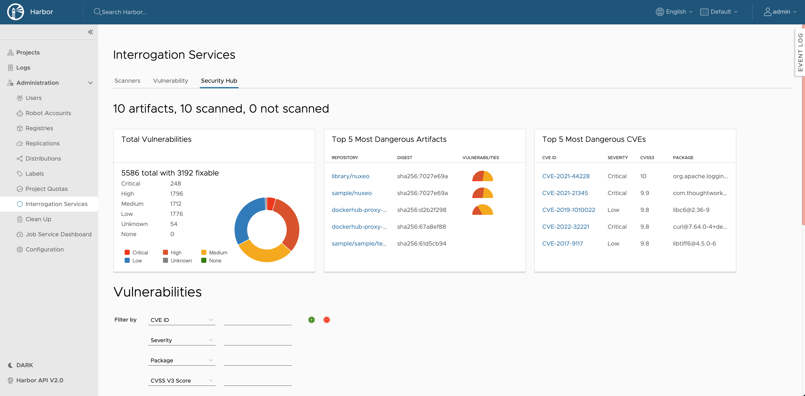
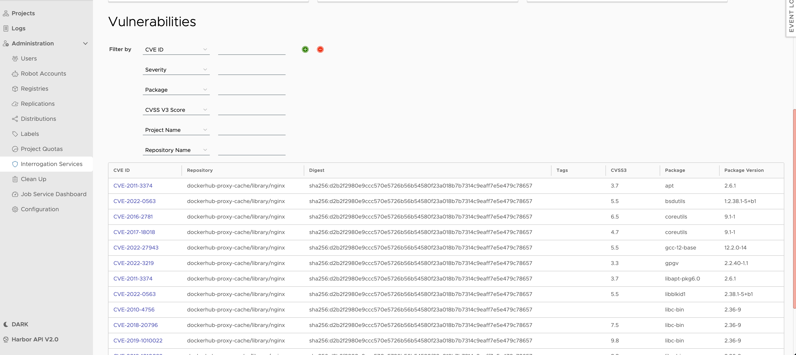

# Proposal: Security Hub

Author: stonezdj

## Discussion
    
[#10496](https://github.com/goharbor/harbor/issues/10496)
[#13](https://github.com/goharbor/pluggable-scanner-spec/issues/13)

## Abstract

Security Hub feature provides a flexible way to search and report the project or application’s vulnerability information for administrators.

## Background

Harbor 2.7.0 provide a way to scan image and export CVE information by project, but it could not search involved images by CVE ID.  it could not review all the CVEs in system level or project level. it could not provide the summary information of current existing CVEs. it can’t provide a way to present a vulnerability in a holistic view with different level such as system level, project level, or any freestyle (label) level. with the CVE search and report feature, administrator could search and report the vulnerability information in a flexible way.

## User stories

1. As an administrator, he/she can check the total number of vulnerabilities scanned in current view (system/project/label), the report include the total number of vulnerabilities count by severity level: Critical, High, Medium, Low, None and Unknown. Most dangerous vulnerabilities, Most dangerous artifacts in current report.
1. As an administrator, he/she can filter vulnerabilities by score range in the current scope, the scope should be project or system level.
1. As an administrator, he/she can filter vulnerabilities by image tag in the current scope.
1. As an administrator, he/she can filter vulnerabilities by package in the current scope.
1. As an administrator, he/she can filter vulnerabilities by CVE id in the current scope.

## Personas

Only system administrators could access the security hub feature.

## None Goals

This proposal does not cover the following items:

1. The security hub feature does not provide a way to search and report the vulnerability information by image layer.
2. It doesn't provide a way to fix the vulnerability or take action to the vulnerability.

## Compatibilities

The implementation of this feature should be compatible with the [pluggable scanner spec v1.0](https://github.com/goharbor/pluggable-scanner-spec) and only support the trivy adapter.

Some table schema should be changed to enable this feature

The scan_report table need to add the following columns:

| Column Name | Description |
| ------------- | ------------- |
| critical_cnt | The current report contains critical CVE’s count  |
| high_cnt  | The current report contains high CVE’s count  |
| medium_cnt | The current report contains medium CVE’s count |
| low_cnt | The current report contains low CVE’s count |
| none_cnt | The current report contains none CVE’s count |
| unknown_cnt | The current report contains unknown CVE’s count |
| fixable_cnt | The current report contains fixible CVE’s count |


## Implementation

There are REST APIs provided:

1. Retrieve the vulnerability summary of the system
```
GET /api/v2.0/security/summary?q=xxx&with_cve=true&with_artifact=true
```
Response data
```
{
   “total_count”: 240,
   “high_count”: 20,
   “critical_count”: 35,
   “medium_count”: 90,
   “low_count”: 23,
   “none_count”: 0,
   “fixiable_count”:103,
   “scanned”, 1032,
   “not_scanned”:59
   “most_dangerous_cve”: [
      {"cve_id":“CVE-2022-32221”, "package": "curl", "version": "2.3.2", "cvss_score_v3": 9.8},
      ...
   ]
   “most_dangerous_artifact”: 
   [
      {“artifact_id”: 2377, “artifact_repository”:”library/nuxas”, “digest”:"sha256:7027e69a2172e38cef8ac2cb1f046025895c9fcf3160e8f70ffb26446f680e4d", “serverity_above_high”: 23} 
      },
   ...
   ]
}
```

To query the security summary of a project

```
GET /api/v2.0/projects/{project_name_or_id}/security/summary?with_cve=true&with_artifact=true
```
Reponse data format is the same as the system level query.

If with_cve, with_artifact are true, then the response data should include the “most_dangerous_cve” and “most_dangerous_artifact” information.


The sql query for this API:

```
-- query all the vulnerability count by severity level
select sum(s.critical_cnt) critical_cnt,
       sum(s.high_cnt)     high_cnt,
       sum(s.medium_cnt)   medium_cnt,
       sum(s.low_cnt)      low_cnt,
       sum(s.none_cnt)     none_cnt,
       sum(s.unknown_cnt)  unknown_cnt,
       sum(s.fixable_cnt)  fixable_cnt
from artifact a
         left join scan_report s on a.digest = s.digest
         where s.registration_uuid = ?

-- query total artifact count

SELECT COUNT(1)
FROM artifact A
WHERE NOT EXISTS (select 1 from artifact_accessory acc WHERE acc.artifact_id = a.id)
  AND (EXISTS (SELECT 1 FROM tag WHERE tag.artifact_id = a.id)
    OR NOT EXISTS (SELECT 1 FROM artifact_reference ref WHERE ref.child_id = a.id))

-- query scanned count
SELECT COUNT(1)
FROM artifact a
WHERE EXISTS (SELECT 1
              FROM scan_report s
              WHERE a.digest = s.digest
                AND s.registration_uuid = ?)
    -- exclude artifact accessory
    AND NOT EXISTS (SELECT 1 FROM artifact_accessory acc WHERE acc.artifact_id = a.id)
    -- exclude artifact without tag and part of the image index
    AND EXISTS (SELECT 1
                FROM tag
                WHERE tag.artifact_id = id
                   OR (NOT EXISTS (SELECT 1 FROM artifact_reference ref WHERE ref.child_id = a.id)))
   -- include image index which is scanned
   OR EXISTS (SELECT 1
              FROM scan_report s,
                   artifact_reference ref
              WHERE s.digest = ref.child_digest
                AND ref.parent_id = a.id AND s.registration_uuid = ?  AND NOT EXISTS (SELECT 1
                                                                                      FROM scan_report s
                                                                                      WHERE s.digest = a.digest and s.registration_uuid = ?)) // scanned count

-- query top 5 of the most dangerous cve
SELECT vr.id,
       vr.cve_id,
       vr.package,
       vr.cvss_score_v3,
       vr.description,
       vr.fixed_version,
       vr.severity,
       CASE vr.severity
           WHEN 'Critical' THEN 5
           WHEN 'High' THEN 4
           WHEN 'Medium' THEN 3
           WHEN 'Low' THEN 2
           WHEN 'None' THEN 1
           WHEN 'Unknown' THEN 0 END AS severity_level
FROM vulnerability_record vr
WHERE EXISTS (SELECT 1 FROM report_vulnerability_record WHERE vuln_record_id = vr.id)
  AND vr.cvss_score_v3 IS NOT NULL
  AND vr.registration_uuid = ?
ORDER BY vr.cvss_score_v3 DESC, severity_level DESC
LIMIT 5

-- query top 5 of the most dangerous artifact
select a.project_id project, a.repository_name repository, a.digest, s.critical_cnt, s.high_cnt, s.medium_cnt, s.low_cnt
from artifact a,
     scan_report s
where a.digest = s.digest
  and s.registration_uuid = ?
order by s.critical_cnt desc, s.high_cnt desc, s.medium_cnt desc, s.low_cnt desc
limit 5

```
If a label is specified in the query condition, the label could be changed to a filter condition of artifact id in the sql query

2. Search Vulnerability information

The Vulnerability is the security issue found in the artifact, it includes the package information and the CVE information, but it is not the CVE itself.
```
GET /api/v2.0/security/vul?q=xxx&tune_count=true
```
Response data
```
[{
“project”: “library”,
“repository”: "library/nuxas”,
“digest”: “sha256:7027e69a2172e38cef8ac2cb1f046025895c9fcf3160e8f70ffb26446f680e4d”,
“tags”: [“v2.3.0”, “latest”],
“css_v3_score”: 8.9,
“cve_id”: “CVE-2022-32221”,
“package” “nfs-utils”,
“package_version” “v3.1.0”,
"fix_version": "2.3.1"
“description”: “The package nuxas before 2.3.0 for Python allows Directory Traversal via a crafted tar file.”,
"urls": “https://nvd.nist.gov/vuln/detail/CVE-2022-32221”,
},
{
  //another cve record
}
]
```

The tune_count option is used to tune the query of the query count, if the query total count > 1000, then the query will display that the total count is more than 1000, and x-total-count will be set to -1, and the response is the same as the query without tune_count option.

The q parameters like q see lib/q to pass the following parameters

| Query condition  | Description                                                              |
| ------------- |--------------------------------------------------------------------------|
| cve_id  | Search vulnerability information by CVE ID, support exact match          |
| severity        | Search vulnerability information by severity level                       |
| cvss_v3_score        | Search vulnerability information by cvss v3 score                        |
| project_id  | Search vulnerability information by project id                           |
| digest     | Search vulnerability information by artifact digest, support exact match |
| repository | Search vulnerability information by repository name, support exact match |
| package | Search vulnerability information by package name, support exact match    |
| tag | Search vulnerability information by tag name, support exact match        |

An example of the query condition:

```
GET /api/v2.0/security/vul?q=cve_id=CVE-2023-12345,cvss_v3_score=[7.0~10.0],severity=Critical,project_id=1,repository=library/nuxas,package=nfs-utils,tag=v2.3.0
```

The sql query for this API:

```
select  vr.cve_id, vr.cvss_score_v3, vr.package, a.repository_name, a.id artifact_id, a.digest, vr.package, vr.package_version, vr.severity, vr.fixed_version, vr.description, vr.urls, a.project_id
from artifact a,
     scan_report s,
     report_vulnerability_record rvr,
     vulnerability_record vr
where a.digest = s.digest
  and s.uuid = rvr.report_uuid
  and rvr.vuln_record_id = vr.id
  and rvr.report_uuid is not null
  and vr.registration_uuid = ? 

```

Database schema change:


scan_report:
```
alter table scan_report add column IF NOT EXISTS  critical_cnt int;
alter table scan_report add column IF NOT EXISTS  high_cnt int;
alter table scan_report add column IF NOT EXISTS  medium_cnt int;
alter table scan_report add column IF NOT EXISTS  low_cnt int;
alter table scan_report add column IF NOT EXISTS  none_cnt int;
alter table scan_report add column IF NOT EXISTS  unknown_cnt int;
alter table scan_report add column IF NOT EXISTS  fixable_cnt int;
```

Beside the upward APIs, there are some other refactor work.

1. To improve the performance, refactor scan report add summary information, such as total, high, low, medium count, fixible in a single scan report, when querying the summary information, these data could be aggregated without join other table.
2. Refactor scan report insert CVE process, regulate the data insert into the table, current cvss_v3_score is emtpy, we need to extract these information from vendor attribute data, and store the information in the cvss_v3_score column.
3. Previous scan report table doesn't contain any critical_cnt, high_cnt, medium_cnt, low_cnt, none_cnt, unknown_cnt, fixable_cnt information, we need to extract these information from vendor attribute data, and store the information in the vendor_attribute column.

## UI work

The draft UI of the security Hub:
Summary:

Search vulnerability:



## Open Questions

 1. Current trivy adapter report doesn't contain the `preferred_cvss` attribute, as a workaround, we need to extract the information from vendor attribute data, waiting for the trivy adapter to provide this information in the scan report, the score will be stored in the `cvss_v3_score`. the final solution is update the plugable-scanner-spec to add the `cvss_v3_score` attribute. there maybe other vendor's score information, but we only support these two vendor's score information when searching. the score information will be stored in the `vulnerability_record` table's vendor_attribute column.

 2. Peformance consideration, a typical registry might have 10000+ artifacts, and each artifact might have 1000+ CVE's, the table of report_vulnerability_record will have 10000000+ records, the query performance is a big concern, we need to refactor the sql query for better performance, and add index for the table. further more we will limit the records returned by a query to 100 records, and add the total count in the response header. all queries should be returned in 1 minute.

 3. The currrent implementation is based on database, it is possible to use other storage in future, such as elasticsearch, if we use elasticsearch, we need to add the support for elasticsearch in the post scan job, to index each CVE records, and add the support for elasticsearch in the query API.