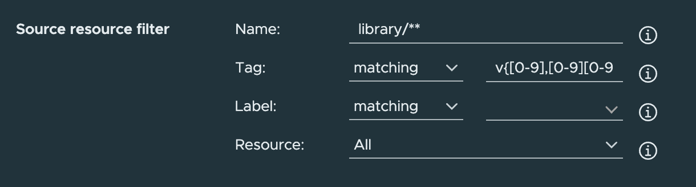
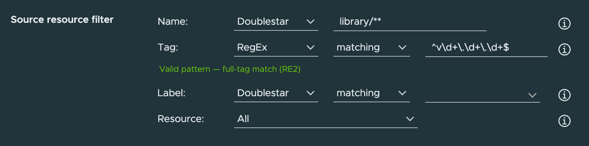

# Proposal: Support RegEx as an Alternative to Doublestar

Author: Vadim Bauer / [@Vad1mo](https://github.com/Vad1mo)

Discussion: [goharbor/harbor#12877](https://github.com/goharbor/harbor/issues/12877), [goharbor/harbor#8614](https://github.com/goharbor/harbor/issues/8614)

## Abstract

Add regular expressions as a second, user-selectable pattern engine next to the existing doublestar glob matching in Harbor's pattern-based filters: tag retention, tag immutability, replication, and P2P preheat. RegEx is an **addition, not a replacement** — every pattern field gets an explicit engine selector that defaults to Doublestar, so users pick per filter whichever engine fits, and no existing rule changes behavior.

## Background

Harbor matches user-supplied patterns with [bmatcuk/doublestar](https://github.com/bmatcuk/doublestar) everywhere: replication filters (`src/pkg/reg/util/pattern.go`), the retention/immutability selector framework (`src/lib/selector/selectors/doublestar`), and P2P preheat. Doublestar is a *path* globbing language. It is a good fit for repository paths (`library/**`), but it cannot express the tag-shaped questions users actually ask:

- **"Final releases only."** `v*.*.*` also matches `v2.0.0-rc.1` and every CI-generated tag such as `v1.9.0-12-ge7e744a7`, because `*` cannot say "digits only".
- **"Exclude pre-releases / suffixed variants."** There is no way to match `1.0.0` while excluding `1.0.0-dev.4` structurally; immutability rules for `major.minor` variants hit the same wall.
- **"Keep the last N CI builds, keep all release tags"** — the monorepo `git describe` tagging scheme from #12877 cannot be separated from release tags with globs alone.

The community's best-known workaround is a brace monster of the form
`v{[0-9],[0-9][0-9],[0-9][0-9][0-9],[0-9][0-9][0-9][0-9]}.{…}.{…}` — verbose, capped at 4 digits per segment, broken for tags without a `v` prefix, and mangled by the portal, which strips the outer braces from tag patterns ([#20806](https://github.com/goharbor/harbor/issues/20806), declared by-design). Others maintain four parallel replication rules (`v1.?.?`, `v1.?.??`, `v1.??.?`, `v1.??.??`) to approximate one regex ([#16131](https://github.com/goharbor/harbor/issues/16131)).

The demand record is long and still open: [#8614](https://github.com/goharbor/harbor/issues/8614) (2019, 39 👍), [#12877](https://github.com/goharbor/harbor/issues/12877) (2020, 55 👍), [#11975](https://github.com/goharbor/harbor/issues/11975) (2020), [#16131](https://github.com/goharbor/harbor/issues/16131) (2021), [#19328](https://github.com/goharbor/harbor/issues/19328) (2023, duplicate of #12877), [#22870](https://github.com/goharbor/harbor/issues/22870) (2026, goes further with SemVer operators).

Harbor 1.9's UI even *advertised* regex support; the claim was removed ([#9206](https://github.com/goharbor/harbor/issues/9206)) because no backend implemented it. This proposal restores a capability Harbor once promised.

**Prior art.** Proposal PR [community#221](https://github.com/goharbor/community/pull/221) already converged, after weighing five alternatives with the community, on an explicit engine selector. Its implementation PR [harbor#18723](https://github.com/goharbor/harbor/pull/18723) was closed unmerged in 2025 for lack of author bandwidth and is explicitly kept as a reference. The maintainer position on that PR stands: regex support should come as a **shared pattern library used consistently across Harbor features**, like doublestar today — not as a single-feature bolt-on. Meanwhile [community#280](https://github.com/goharbor/community/pull/280) (proxy cache repository filter) independently introduces the exact same shape for a new surface: a pattern plus a `kind: regex|doublestar` discriminator. This proposal makes that shape the rule rather than the exception.

## Goals

- Regex matching for tag, repository/name, and label patterns, selectable per filter/selector.
- One shared engine used by retention, immutability, replication, and preheat.
- Doublestar stays the default everywhere; zero behavior change for existing rules; no forced migration.
- Invalid patterns are rejected when the rule is saved, never at job runtime.

## Proposal

### 1. One shared engine: a `regexp` selector kind

Implement the engine once as a sibling of the doublestar selector:

```
src/lib/selector/selectors/regexp/selector.go        Kind = "regexp"
src/lib/selector/selectors/regexp/selector_test.go
```

registered in the existing kind-keyed registry (`src/lib/selector/selectors/index`), with the same decorations as doublestar (`matches`, `excludes`, `repoMatches`, `repoExcludes`, `nsMatches`, `nsExcludes`) and the same `untagged` extras flag. All four surfaces delegate to it, which answers the cross-feature-consistency requirement raised on #8614, #12877, and #18723 — while still allowing phased delivery per surface.

Engine semantics:

- **Go stdlib `regexp` (RE2).** Linear-time matching, structurally immune to catastrophic backtracking, so user-supplied patterns introduce no ReDoS surface. Trade-off, documented up front: no backreferences, no lookahead/lookbehind. Harbor already uses stdlib regex for admin-supplied patterns (OIDC group filter, audit log patterns), and adds no new dependency.
- **Full-string matching**, the same semantics as `doublestar.Match`: patterns are evaluated anchored (`\A(?:p)\z`). `v\d+` matches the tag `v1`, not every tag containing `v1`. Users who want substring semantics write `.*` explicitly. This keeps the two engines interchangeable in meaning: only the pattern language differs.
- **Empty pattern matches everything**, matching the existing doublestar wrapper behavior.
- Patterns are **compiled once** when a policy is loaded and cached; a maximum pattern length (proposed: 512 characters) bounds compile cost.
- Untagged artifacts are governed by the existing `untagged` flag only — a regex is never silently evaluated against an empty tag string (a defect of the reference PR #18723).

### Supported regex capabilities

Patterns follow [RE2 syntax](https://github.com/google/re2/wiki/Syntax) exactly as implemented by Go's `regexp` package — what compiles there is what Harbor accepts, nothing Harbor-specific added or removed.

**Supported:**

| Capability | Examples |
|---|---|
| Literals, any-char | `latest`, `.` |
| Character classes, ranges, negation | `[a-z0-9]`, `[^-]`, `[0-9-]` |
| Perl / POSIX / Unicode classes | `\d` `\w` `\s`, `[[:alnum:]]`, `\p{L}` |
| Quantifiers, incl. bounded and lazy | `*` `+` `?`, `{3}` `{1,4}`, `*?` |
| Alternation and grouping | `(alpine\|slim)`, non-capturing `(?:…)` |
| Named capture groups | `(?P<major>\d+)` — accepted and validated; group values carry no semantics yet (reserved for future SemVer-aware rules, #22870) |
| Anchors | `^` `$` `\b` `\A` `\z` — accepted, redundant under full-string matching |
| Flags | `(?i)` case-insensitive, `(?s)`, `(?U)` |
| Escaping | `\.`, `\\`, `\Q…\E` |

**Not supported** (RE2 exclusions — the price of guaranteed linear-time matching):

- Lookahead / lookbehind: `(?=…)`, `(?!…)`, `(?<=…)`, `(?<!…)`
- Backreferences: `\1`, `(?P=name)`
- Atomic groups, possessive quantifiers, recursion, conditionals

The most common PCRE idiom Harbor users will miss is negative lookahead ("tags *not* ending in `-source`"); the `excluding` decoration covers exactly that case (`excluding` + `.*-source`), which is why decorations stay orthogonal to the engine.

Semantics recap: patterns are full-string matches (implicitly anchored, like doublestar), case-sensitive unless `(?i)`, empty pattern matches everything, maximum length 512 characters.

**Reference recipes** (all verified to compile and match under Go's `regexp`):

| Intent | Decoration | Pattern |
|---|---|---|
| Final releases only | matching | `v?\d+\.\d+\.\d+` |
| Strict [SemVer 2.0](https://semver.org/#is-there-a-suggested-regular-expression-regex-to-check-a-semver-string) | matching | the official semver.org regex, unchanged — it uses only RE2-supported constructs |
| Drop pre-releases, keep everything else | excluding | `.*-(alpha\|beta\|rc)\.?\d*` |
| CI `git describe` tags | matching | `v\d+\.\d+\.\d+-\d+-g[0-9a-f]+` |
| Everything except `-source` variants | excluding | `.*-source` |
| `latest` in any casing | matching | `(?i)latest` |

### 2. Explicit engine selection, per pattern field

The user chooses the engine with a small selector rendered next to each pattern input, defaulting to **Doublestar**. This is the approach already finalized in community#221 after community review, and the same model #22870 arrived at independently:

- *Sigil detection* (`/pattern/` means regex) was rejected: an invisible mode switch, ambiguous edge cases, and patterns that legitimately start with `/`.
- *Auto-converting existing globs to regex* was rejected: a translator must be 100% faithful or upgrade silently changes matching behavior — the worst possible failure mode for retention rules that delete images.
- *Regex-only* was rejected: breaks every existing installation, and doublestar remains genuinely better for repository paths (`library/**`).
- *Extending the existing `matching`/`excluding` dropdown* with `regex matching`/`regex excluding` options — the smallest visible UI change, and effectively the shape of reference PR #18723 (which encoded the engine into new filter *types*, `tagRegex`/`labelRegex`). Rejected **as the data model**, for four reasons:
  1. It conflates two orthogonal dimensions — polarity (match/exclude) and pattern language — into one enum. The option list grows multiplicatively: retention/immutability selectors already carry six decorations (`matches`, `excludes`, `repoMatches`, `repoExcludes`, `nsMatches`, `nsExcludes`), which would become twelve, and any future engine doubles it again.
  2. It doesn't actually avoid a new control where it matters most after tags: the replication **name** filter has no decoration dropdown at all today (`Filter.Validate()` rejects decorations on name/resource filters), so regex on repository names would introduce a dropdown either way.
  3. The selector framework registers selectors by `kind` with decorations *per kind*; encoding the engine into the decoration string bypasses that design, and diverges from the `kind` discriminator community#280 already introduces for the proxy-cache filter — Harbor would end up with two vocabularies for the same concept.
  4. The filter-type flavor of this in #18723 is precisely what maintainers redirected toward a shared kind-based library.

  It remains available as a **presentation** choice: because the model stays `(kind, decoration)`, the portal is free to render one combined dropdown for filters with only two decorations (tag: four options) instead of two selects, and map the choice onto the two fields. That is a portal-maintainer call per form, not an API decision — the mockups below show the two-select variant because it generalizes to all surfaces.

### 3. UI

Before/after of the "Source resource filter" block, rendered in the current portal (the proposed engine selector added in place, styled like the existing decoration select):

**Before — today**



**After — proposed**



Full dialog for context: [before](images/regex-filter/before-dialog.png) / [after](images/regex-filter/after-dialog.png).

The same task side by side — *replicate final releases only*:

| Tag | Doublestar `v*.*.*` | RegEx `^v\d+\.\d+\.\d+$` |
|---|---|---|
| `v1.9.0` | ✓ replicated | ✓ replicated |
| `v1.10.3` | ✓ replicated | ✓ replicated |
| `v2.0.0-rc.1` | ✓ replicated — **unwanted** | ✗ skipped |
| `v1.9.0-12-ge7e744a7` | ✓ replicated — **unwanted** | ✗ skipped |
| `latest` | ✗ skipped | ✗ skipped |

Portal changes:

- Engine selector (`Doublestar` / `RegEx`) per pattern field in the retention, immutability, replication, and preheat forms. For retention/immutability the decoration dropdowns are already driven by `GET /retentions/metadatas`; the selector binds to the same metadata.
- **Engine-aware input handling.** The portal today auto-wraps comma-separated lists in `{…}` and strips outer braces on read — doublestar-specific syntax that would corrupt regex quantifiers (`{2,3}`) and alternation. In regex mode this transformation is disabled; alternation is expressed natively (`(a|b)`).
- Inline validation with the compile error shown at the field, updated tooltips with one example per engine, translations for all 10 locales.
- Tag retention's existing **dry-run** works unchanged with regex selectors and is the recommended way to test a pattern before enabling a rule.

### 4. API

- `RetentionSelector.kind` / `ImmutableSelector.kind` are already free-form strings in swagger and persisted inside JSON blobs — `"regexp"` becomes a second accepted value. **No schema or generated-client change.**
- `GET /retentions/metadatas` currently returns a hardcoded selector list; it is rewired to the selector registry (`index.Index()`, which exists for exactly this purpose and is currently unused), so the new kind — and any future one — is advertised to the UI automatically.
- `ReplicationFilter` gains an optional `kind` field (`doublestar` when absent), marked `x-isnullable` per the existing backward-compat convention in swagger.
- Preheat policy filters (an opaque JSON string today) gain an optional per-filter `kind` with the same default.
- The `kind` literal should be harmonized with community#280 before either merges, so Harbor ends up with one discriminator vocabulary (`doublestar` | `regexp`), not two.

### 5. Validation at write time

Invalid regexes are rejected with `400` when the policy is created or updated: `Filter.Validate()` for replication, `ValidateRetentionPolicy` and the immutability controller (which performs no pattern validation today) for the selector surfaces. Runtime evaluation can then assume compiled patterns. This is deliberately the opposite of the existing OIDC group-filter precedent, which compiles at evaluation time and fails open — acceptable for one admin setting, not for rules that delete or replicate images.

## Phased rollout

| Phase | Surface | Why this order |
|---|---|---|
| 1 | Shared engine + **tag retention + tag immutability** | `kind` field already exists and is persisted in JSON (`retention_policy.data`, `immutable_tag_rule.tag_filter`) — no migration, smallest diff, highest-voted use case (#12877) |
| 2 | **Replication** | needs the new `Filter.kind` field and adapter attention (see Open issues) — the second-highest demand (#8614) |
| 3 | **P2P preheat** | needs a `kind` concept introduced into its filter JSON and its filter construction routed through the registry |

Each phase is independently shippable; phase 1 alone already resolves #12877 and #19328.

## Non-Goals

- **Replacing or deprecating doublestar.** It remains the default and the better tool for repository-path globs.
- **Automatic migration of existing rules.** Users who want to convert can do so per rule; community-built translators (e.g. [RegexStar](https://schich.tel/RegexStar/)) help with the mechanical part.
- **SemVer-aware structured rules** — capture groups, `MAJOR >= 3`-style operators, "latest N by parsed version" (#22870, #11975). Out of scope here, but deliberately enabled later: those designs need a regex engine with defined semantics underneath, which is exactly what this proposal lands.
- Non-selector pattern surfaces (CSV export selector, LDAP/OIDC filters) and PCRE-only features.

## Rationale

The decisive alternative analysis already happened in community#221 (five approaches, explicit selector chosen) and is summarized in §2 above rather than re-opened. What this proposal changes against the reference implementation #18723 — and why it will not fail the same way:

| #18723 | This proposal |
|---|---|
| Replication only | shared selector kind used by all four surfaces |
| New filter *types* (`tagRegex`, `labelRegex`) multiplying the enum | one orthogonal `kind` discriminator, aligned with the existing selector model and community#280 |
| `regexp.Compile` inside the filter loop, per artifact | compile once per policy, cached |
| compile errors surface as failed replication executions | rejected with `400` at rule save + inline UI validation |
| untagged artifacts matched against `""` | existing `untagged` flag semantics preserved |

## Compatibility

- **Upgrade:** absent `kind` means `doublestar` on every surface; existing rules are byte-identical and behave identically. No database migration anywhere (all affected storage is JSON text columns).
- **API clients:** `kind` is additive and optional; generated models for retention/immutability need no change at all.
- **Downgrade caveat:** on an older core, a retention/immutability rule with `kind: "regexp"` fails loudly (`selector regexp is not registered`) — no silent misinterpretation. A replication filter with an unknown `kind` field on an old version would be *dropped by JSON unmarshalling* and the pattern read as doublestar; release notes must call this out.
- The dead beego validation tags `valid:"Match(doublestar)"` on the selector models (not enforced on the v2 API path today) are relaxed to the supported kind set as part of phase 1.

## Implementation

Touch points, verified against `main`:

**Phase 0 — engine**
- `src/lib/selector/selectors/regexp/` new selector; register in `src/lib/selector/selectors/index/index.go`.
- `selector.Factory` cannot return an error today; widen it to `func(decoration string, pattern any, extras string) (Selector, error)` (internal interface, a handful of implementors) so compile failures have a home at construction time.

**Phase 1 — retention + immutability**
- Relax `Kind` validation: `src/pkg/retention/policy/rule/models.go`, `src/pkg/immutable/model/rule.go`.
- Write-time pattern validation in `src/controller/retention` / `src/controller/immutable`.
- Replace the hardcoded selector metadata payload in `src/server/v2.0/handler/retention.go` with `index.Index()`.
- Portal: engine selector in `tag-retention/add-rule` and `immutable-tag/add-rule`; make the `{…}` comma-list wrapping kind-aware.

**Phase 2 — replication**
- `src/pkg/reg/model/policy.go`: `Filter.Kind` + `Validate()`.
- Route `src/pkg/reg/util/pattern.go` / `src/pkg/reg/filter/{artifact,repository}.go` and the direct `util.Match` calls in adapters through the shared engine.
- `api/v2.0/swagger.yaml` `ReplicationFilter` + portal `create-edit-rule` component + i18n.

**Phase 3 — preheat**
- `src/pkg/p2p/preheat/policy/filter.go` `buildFilter` via the registry; per-filter `kind` in the policy filter JSON.

**Testing** — regression fixtures come straight from the issue threads: the monorepo `git describe` tag corpus and digest-sharing `latest` case from #12877, pre-release sets from #19328/#16131, and equivalence tests asserting doublestar rules behave identically before and after.

## Open issues

- **Replication name-filter performance.** Adapters use `util.IsSpecificPath*` to turn a glob into a list of exact repositories and avoid listing a remote's full catalog. A regex almost never qualifies, forcing a full catalog walk on the remote. Mitigations to evaluate: derive a listing prefix via `regexp.Regexp.LiteralPrefix()`, and/or restrict phase 2's regex support to tag/label filters first, keeping name filters doublestar-only until prefix extraction is in place.
- **`kind` literal** — `regexp` (this proposal, matching the selector-kind convention) vs `regex` (community#280). One vocabulary should win; needs a maintainer call.
- Whether the engine selector should also be exposed for label filters, or labels stay exact/doublestar (labels are short exact strings in practice).
