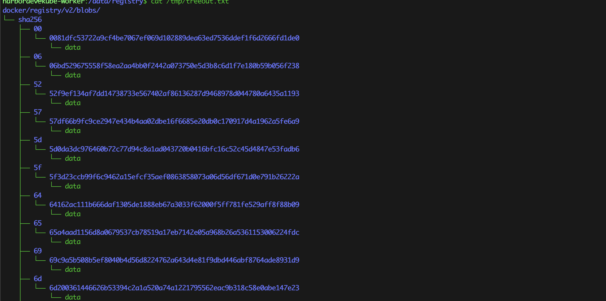
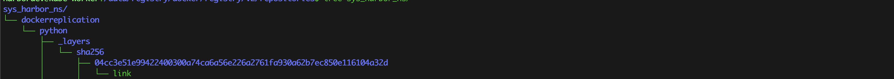
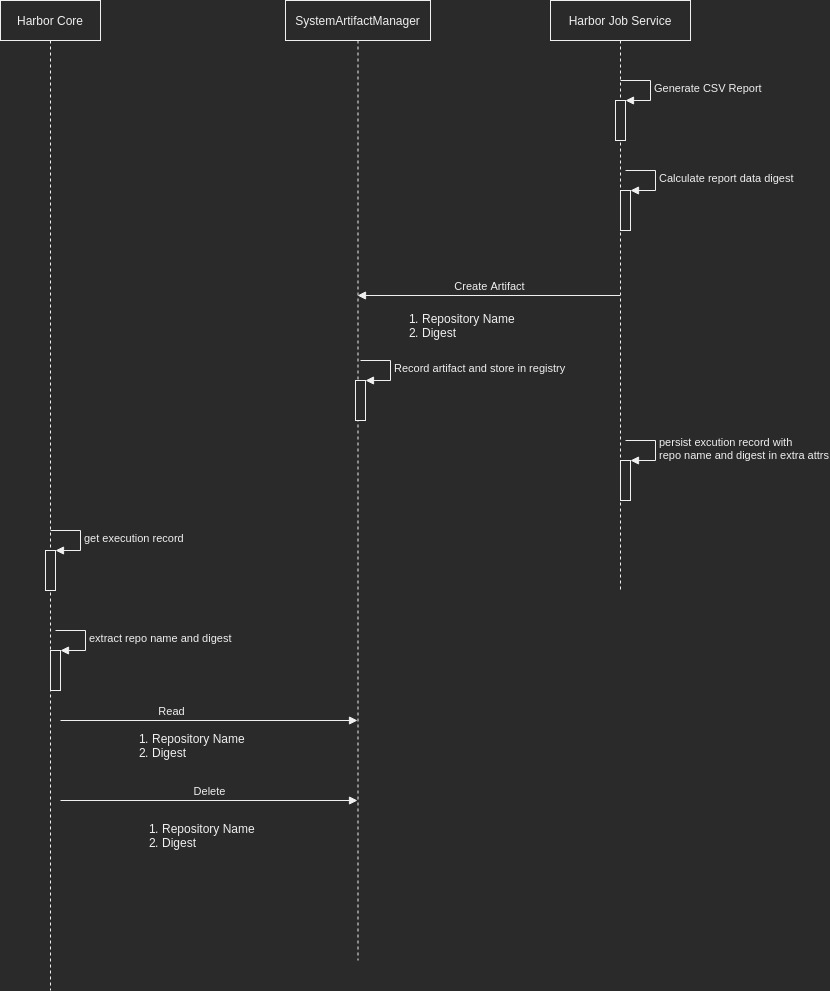
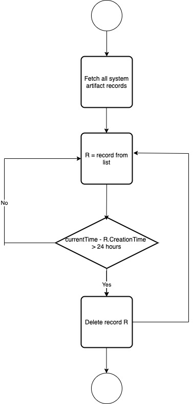

## Abstract

This proposal introduces a framework that exposes the registry as a backend store for system aritfacts created by various Harbor subsystems.

## Use cases
* Sharing of ephemeral data items between Harbor services/components. Currently, `harbor-core` and `harbor-jobservice` would be the primary consumers of this mechanism of data sharing. However, additional services being introduced in the future can also leverage this particular data sharing mechanism.

## Technical Description

Often there arise use cases where-in two services of Harbor services would want to share data/results generated from an aysnchronous computation. Consider the following situation for e.g:  a long running data export job that has been triggered by the `Harbor Core` service and is executing on the `Harbor Jobservice`. The data artifact generated by the `Harbor Jobservice` would need to be shared with the `Harbor Core` service so that it can be downloaded by the client using a REST API. Upon download, the CSV file is deleted. 

For the above use case, discussed briefly below are the alternate approaches

### Stateful HTTP session between Harbor job service and Harbor core.

A stateful session-based REST API exposed between the job service and Harbor core that would be used to stream the data file. Such an approach has the following drawbacks:
1. A stateful API implies some level of synchronous API execution. This will limit the Harbor job service capability to service job execution requests at scale.
2. In Kubernetes environments, where-in multiple replicas of the job service may exist, the Harbor core service would need to maintain state about the job service replica to which the job was submitted to create the artifact so that it can subsequently download the artifact when an external user requests it through an API.
3. Requires implementation of complex state management logic within the Harbor job service and Harbor core. Depending upon the use cases, there is no guarantee that such a complex state management logic would cater to future use cases with simple extensibility.

### Using Harbor database 
Storing the generated data artifact within the database table as a BLOB. The core service then reads the BLOB from the table - This approach is better than the complex stateful HTTP interfaces described above. 
PostgresQL has built-in support for storing binary data (`byteea` and `LOB`).
    * Using a `byteea` column - Stores the binary data directly into the database field thereby simplyfying retrieval. However, storing arbitrary binary data would require escaping/encoding prior to storage on the server. Similarly, reading such data would require decoding the binary data on the server. Both read/write hence would incur significant memory and compute overheads on the server. Additionally, the curernt Go PostgresQL database drivers return the data of such `byteea` columns as `[]byte`. For a large data file, the service reading the data would have to buffer all the data in memory again resulting in memory overheads. In summary, while this technique is great for storing compressed textual data (which has a high compression ratio), it is not a good choice for storing arbitrary binary data as intended in the proposal which aims to store **both** text as binary data as artifacts.
    * Using a `LOB` field. Stores the binary data outside of the database and stores a pointer to the binary data location as an `OID` within the database table. It is the responsibility of the consumer to fetch the binary data. While the `LOB` allows random seek and streaming, existing Golang PostgresQL drivers do not support the `LOB` APIs unlike Java PostgresQL JDBC driver or the C based APIs.


The above limitations result in this approach not being adopted.

### Using persistent volumes
Store generated data artifact on a data volume mounted within the service container - This approach exposes the filesystem to the service. This will allow consumers to store data files using the standard filesystem APIs. However, there are limitations with using volumes to share data between Harbor core and Harbor job service. If the jobservice component uses the  `Deployment` and volumes are mounted in  `ReadWriteOnce` mode, then the deployment is not scalable since the volume cannot be mounted to multi-pods. If the jobservice were to use a `StatefulSet` with volumes mounted in `ReadWriteOnce` mode, then the job service is scalable, however files created in one pod cannot be read by the other. This can be addressed by mounting all persistent volumes as `ReadWriteMany`, however the `ReadWriteMany` mode is not supported by all CSI drivers. Refer the [PersistentVolumes documentaton](https://kubernetes.io/docs/concepts/storage/persistent-volumes/) for details. Hence this option cannot be adopted.
   

Due to the  shorcomings of the above approaches, we explore the approach of using the registry as an intermediate store for system-generated data that needs to be shared across Harbor services. The next sections provide further details on this approach.

### System Data Artifacts

The proposal introduces the concept of a system data artifact. A system data artifact:
* Is an arbitrary blob of data in text or binary.
* Is created by a Harbor service to be consumed by other Harbor services.
* Has a definite lifespan.
* Does not contain an OCI compatible manifest for describing the artifact data layers.

### Ownership and storage layout

This section details the ownership terminology for system data artifacts and the associated storage layout within the registry

* Vendor - the Harbor subsystem that introduced the system artifact. For e.g. for CSV export data, the vendor could be `ScanExportJob`
* Repository - the name of the repository that would contain the data blob.
* Type - The type of data present within the repository. For e.g. a scan data export job could create a detailed CSV export data file (`Type` = `CSVExportDetail`) as well as a summarized report file (`Type` = `ScanSummary`)
* Digest - the digest of the data blob present within the repository.

The following rules apply:

* A `Vendor` can create **multiple repositories**
* A `Repository` is associated with a single `Vendor`
* A `Repository` can have multiple `Type`s of data blobs
* A `Digest` is associated with a single data blob.


To prevent namespace clashes between user-created artifacts and system artifacts, all system artifacts would be created under a top level system namesapce called `sys_harbor_ns`
Additionally, the middleware for `Project` API would need to enhanced to validate that the internal system namespace is not being used during a CRUD operation.

The below diagram depcits the storage hierarchy associated with system aritfacts within the `blobs` folder of the registry 

A sample storage hierarchy for an arbitrary created artifact under `repositories` folder within the registry 

The complete system artifact repository name would hence be : `sys_harbor_ns/<vendor>/<repository-name>/<type>`

### Tracking System Data Artifact Creation

The following structure would be used to track the creation of system data artifacts within Harbor
```go
// SystemArtifact represents a tracking record for each system artifact that has been
// created within registry using the system artifact manager
type SystemArtifact struct {
	ID int64 `orm:"pk;auto;column(id)"`
	// the name of repository associated with the artifact
	Repository string `orm:"unique;column(repository)"`
	// the SHA-256 digest of the artifact data.
	Digest string `orm:"column(digest)"`
	// the size of the artifact data in bytes
	Size int64 `orm:"column(size)"`
	// the harbor subsystem that created the artifact
	Vendor string `orm:column(vendor)`
	// the type of the system artifact.
	// the type field specifies the type of artifact data and is useful when a harbor component generates more than one
	// kind of artifact. for e.g. a scan data export job could create a detailed CSV export data file as well
	// as an summary export file. here type could be set to "CSVDetail" and "ScanSummary"
	Type string `orm:column(type)`
	// the time of creation of the system artifact
	CreateTime time.Time `orm:"column(create_time)"`
	// optional extra attributes for the system artifact
	ExtraAttrs string `orm:"column(extra_attrs)"`
}

func (sa *SystemArtifact) TableName() string {
	return "system_artifact"
}

func (sa *SystemArtifact) TableUnique() [][]string {
	return [][]string{{"repository_name", "digest"}}
}

```

Below is the DAO interface for interacting with system data tracking records in the database

```go
// DAO defines an data access interface for manging the CRUD and read of system
// artifact tracking records
type DAO interface {

	// Create a system artifact tracking record.
	Create(ctx context.Context, artifactRecord *SystemArtifact) (int64, error)

	// Get a system artifact tracking record identified by repository and digest
	Get(ctx context.Context, repository string, digest string) (*SystemArtifact, error)

	// Delete a system artifact tracking record identified by repository and digest
	Delete(ctx context.Context, repository string, digest string) error

	// List all the system artifact records that match the criteria specified
	// within the query.
	List(ctx context.Context, query *q.Query) ([]*SystemArtifact, error)
}
```


### System Data Artifact CRUD API

The below interface defines an API that is used by Harbor subsystems to create system data artifacts

```go
// SystemArtifactManager provides a low-level interface for harbor services
// to create registry artifacts containing arbitrary data but which
// are not standard OCI artifacts.
// By using this framework, harbor components can create artifacts for
// cross component data sharing. The framework abstracts out the book-keeping
// logic involved in managing and tracking system artifacts.
// The SystemArtifactManager ultimately relies on the harbor registry client to perform
// the BLOB related operations into the registry.
type SystemArtifactManager interface {

	// Create a system artifact described by artifact record.
	// The reader would be used to read from the underlying data artifact.
	// Returns a system artifact tracking record id or any errors encountered in the data artifact upload process.
	// Invoking this API would result in a repository being created with the specified name and digest within the registry.
	Create(ctx context.Context, artifactRecord *SystemArtifact, reader io.Reader) (int64, error)

	// Read a system artifact described by repository name and digest.
	// The reader is responsible for closing the IO stream after the read completes.
	Read(ctx context.Context, repository string, digest string) (io.ReadCloser, error)

	// Deletes a system artifact identified by a repository name and digest.
	// Also deletes the tracking record from the underlying table.
	Delete(ctx context.Context, string, digest string) error

	// Exists checks for the existence of a system artifact identified by repository and digest.
	// A system artifact is considered as in existence if both the following conditions are true:
	// 1. There is a system artifact tracking record within the Harbor DB
	// 2. There is a BLOB corresponding to the repository name and digest obtained from system artifact record.
	Exists(ctx context.Context, repository string, digest string) (bool, error)

	// Get retrives a system artifact record identified by repository and digest
	Get(ctx context.Context, repository string, digest string) (*SystemArtifact, error)

	// GetUntrackedArtifacts gets a list of system artifacts which exist within the
	// registry storage, but there are no corresponding tracking records in the system artifacts table
	// the returned value is a list of strings in the format <repository>:<digest>
	GetUntrackedArtifacts(ctx context.Context) ([]string, error)

	// GetStaleArtifacts gets a list of system artifacts that have a tracking record within the
	// database, but the artifact actually does not exist on the registry storage.
	GetStaleArtifacts(ctx context.Context) ([]*SystemArtifact, error)

	// GetStorageSize returns the total disk space used by the system artifacts stored in the registry.
	GetStorageSize(ctx context.Context) (int64, error)

	// Register a clean-up criteria for a specific vendor and artifact type combination.
	RegisterCleanupCriteria(vendor string, artifactType string, criteria *CleanupCriteria)
}
```

### Putting it all together

Below diagram depicts an interaction diagram between harbor core, harbor job service and the system artifact data manager for exporting reports to the end user 


### Artifact Cleanup

Every harbor component is responsible for clean-up of any system artifact data that it generates. Ideally, the clean-up of the system artifact data should happen as soon as it's consumption completes. For e.g. CSV data reports are deleted immediately once the user completes downloading the CSV report. However, there are following cases where-in on-demand deletion of the system artifact does not happen.

1. There is an error in the deletion process or completion of the on-demand artifact access request.
2. The consumer never consumes the system artifact (e.g. user does not download the generated CSV data report)

To address the use cases above, the framework implements a clean-up job that runs by default every 24 hours and deletes artifact data older than the past 24 hours from the point at which the job started. Consumers of the framework however have a mechanism to control the lifespan of the generated artifacts by specifying an implementation of the below interface and registering it with the framework within a package level `init()` method for the respective functionality package.

```go
// CleanupCriteria provides an interface that can be implemented
// by consumers of the system artifact management framework to
// provide a custom clean-up criteria. This allows producers of the
// system artifact data to control the lifespan of the generated artifact
// records and data.
// Every system data artifact produces must register a cleanup criteria.
type CleanupCriteria interface {
	List(ctx context.Context) ([]*SystemArtifact, error)
}
```
The framework provides a default implementation that returns tracking records for artifacts older than 24 hours.

```go
type DefaultCleanupCritiera struct{}

func (dcc *DefaultCleanupCritiera) List(ctx context.Context) ([]*SystemArtifact, error) {

	artifacts := make([]*SystemArtifact, 0)

	// populate system artifact records for artifacts that are older than 24 hours.

	return artifacts, nil
}
```
The below data flowchart depicts the cleanup logic that would be executed periodically



#### Cleanup of stale and untracked system artifacts

To prevent any inconsistency in the state of the system artifact tracking records in the database and the actual registry store content, a reconciliation mechanism is employed where-in:

1. Delete from registry store all system artifacts that are found in the registry but do not have a corresponding tracking record in the database 
2. Delete all tracking records that are present in the database, but have no corresponding artifact within the registry store.

#### Isolation from existing Harbor Garbage Collection

The current Harbor Garbage collection logic uses the `Artifacts` and the `ArtifactThrash` tables to identify the registry artifacts to be garbage collected. The standard artifact upload mechanism ensures that the `Artifact` tables are populated when pushing OCI artifacts to Harbor. 
The `SystemArtifactManager` on the other hand **does not** insert any records into the `Artfact` tables. It manages it's own table to track system artifacts. Hence the existing Harbor garbage collection job does not know about the created system artifacts and hence would not clean them up.

### Storage Quota Management

In the first iteration of the framework, the quota for system artifact data is unlimited. There is no mechanism to specify a storage quota for different kinds of system artifacts. System artifact data quota can be specified at one of the following levels

1. A quota for each vendor who generates a system artifact.
2. A quota at the broader system level irrespective of the vendor type

A subsequent iteration of the framework in a later release could implement an elaborate quota management system for system artifacts.

### Conformance to OCI Artifact Standard
System data artifacts do not have corresponding Manifests and hence  *do not* conform to the OCI Artifact specification.

### UI/API visibility of system artifacts

System artrifacts are created by internal harbor components and it is not necessary that all generated artifact data be user facing. For e.g. a particular feature may run a job that generates raw data and a subsequent job that runs would aggregate the data generated by the first job. Hence 
If an external user or an API client is allowed to interact with the artifact manager and perform CRUD on system artifacts it would tamper the integrity of the generated artifact and in some cases even interfere with functionality behavior. Additionally, exposing this data to the system admin in the UI or API would result in poor user experience and confusion, since internal details would be leaked to the end user who would have no idea on how these artifacts are generated, their lifetime and utilization. 

Hence system artifacts would not be exposed in the UI or via an API.

The storage occupied by the Harbor registry would also consider the total space occupied by all the system artifacts.