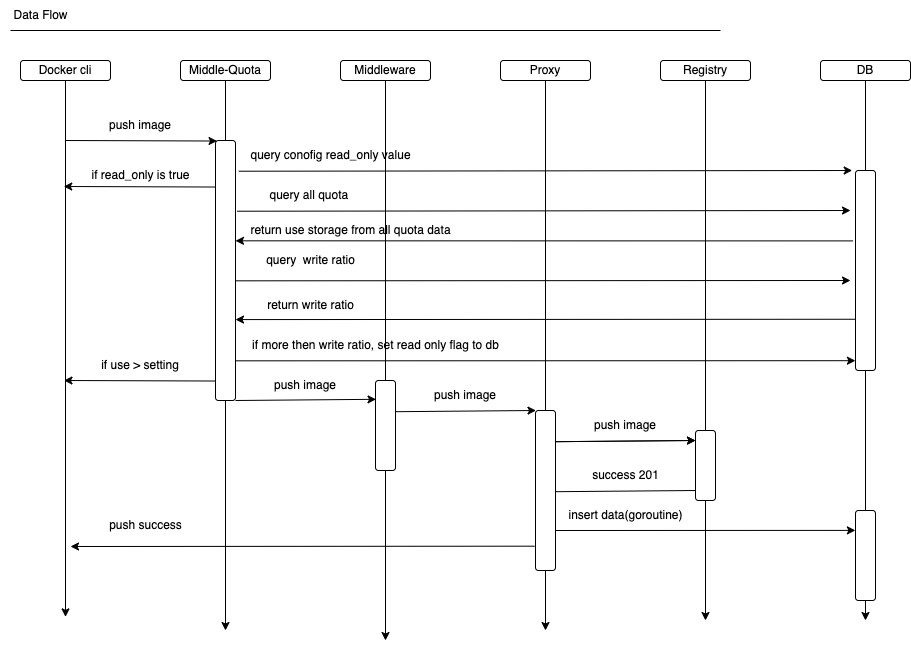

# System Quota

Author: Leng RongFu

## Abstract

Harbor enforces quotas on resource usage of system , setting a hard limit on storage your system can use and can not push artificial when user storage more than system write storage limit.


## Background

Currently, users can set project storage quota, but every project quota is independent，maybe this project storage quota sum while more then system storage, so we need set system storage quota, in the set project storage quota is to check current project storage quota whether more then system storage quota.

Currently, user can always push artifact to system, until not available system storage, at this time system can not write and read, and when the host has no available storage, the system cannot execute image GC, system recovery is more difficult.

## User Stories

### Story 1
As a system administrator, I can set the default limit on system storage.

### Story 2
As a system administrator, I can set the system can write storage ratio.

## Premise
1, The shared blob in project won't be be double-counted.
2, The shared blob cross project will be be double-counted.

## Proposal

We propose the following solutions:

- System quota
1. In the config management system settings page, administration can set system storage quota.
2. In the quota management page when administration update project quota, get system storage quota, if values is -1. skip validate.
3. else validate whether sum of all quotas more than the system quota.

- System write ratio
1. In the config management system settings page, administration can set system write storage ratio.
2. Check whether the usage ratio is greater than the configured write ratio during image upload.
3. The usage ratio is calculated as: (usage of all project quotas) / (system storage quota).
4. If the usage ratio more than the the write ratio, set the system to read-only.
5. When delete image or helm chart, If the usage ratio less than the write ratio, remove the system to read-only.
6. When GC, If the usage ratio less than the write ratio, remove the system to read-only..

  
### APIs for system storage quota

 1. Get quotas

    ```
    GET /api/v2.0/configurations
    {
      "hard_storage": {
        "editable": true,
        "value": "1G"# when user not setting, system default value is -1.
	    },
      "write_ratio": {
	      "editable": true,
	      "value": "95%", # when user not setting, system default value is 100%.
	    }
    }
    ```
    
 2. Update quota

    ```
    PUT /api/v2.0/configurations
    {
      "hard_storage":"1G",
      "write_ratio":"95%",
      "read_only": "true", # when user use storage ratio more then system set storage ratio, set read_only value to true. when less then set read_only value to false.
    }
    ```


### Configurations Manager

Update `AllConfigs(ctx context.Context) (map[string]interface{}, error)` and `UpdateUserConfigs(ctx context.Context, conf map[string]interface{}) error` method.

### Project Manager
1. Update project quota
    - Get system hard storage limit.
    - List all quota info, calculate the sum of the current project quota.
    - Check whether the system storage quota is exceeded.

### Data Flow in Docker registry

#The date flow to push a image into Harbor, check storage usage ratio:

