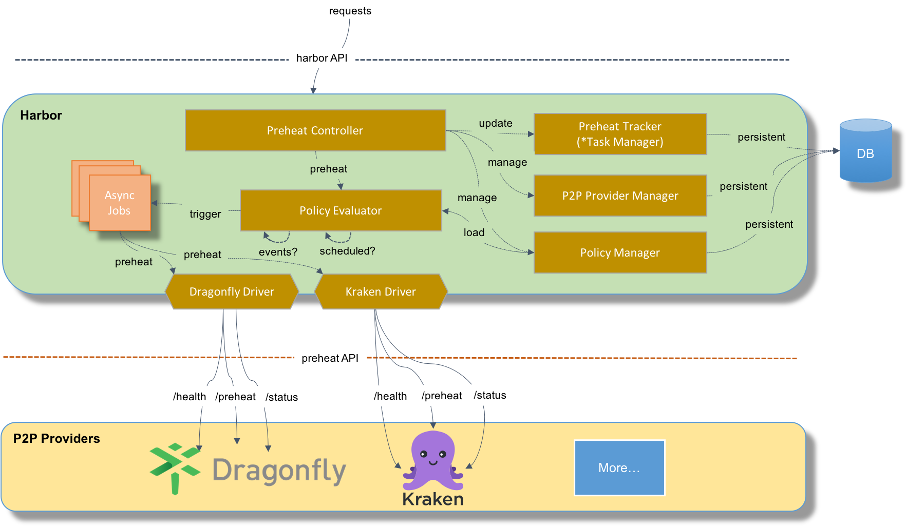
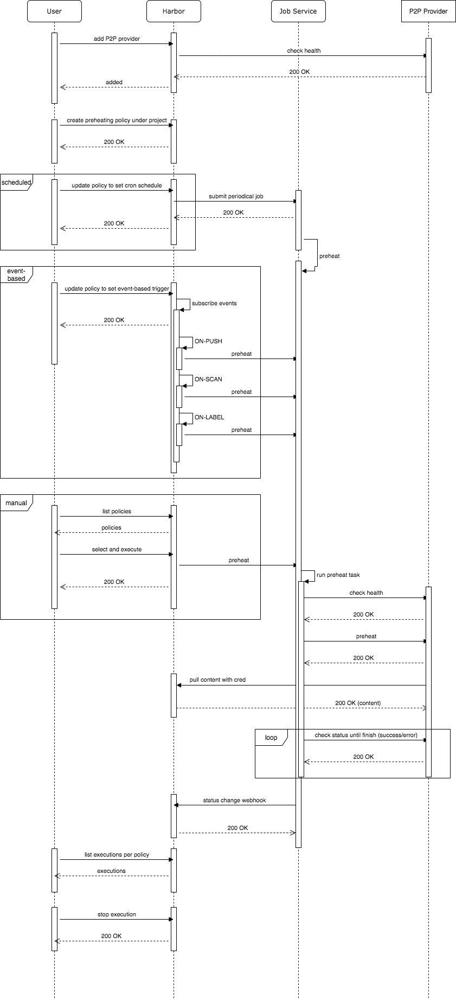
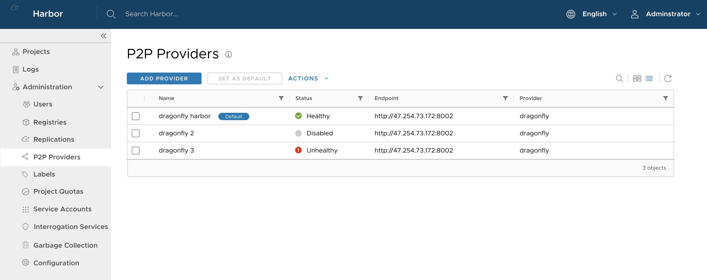
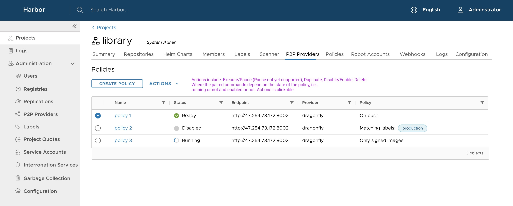
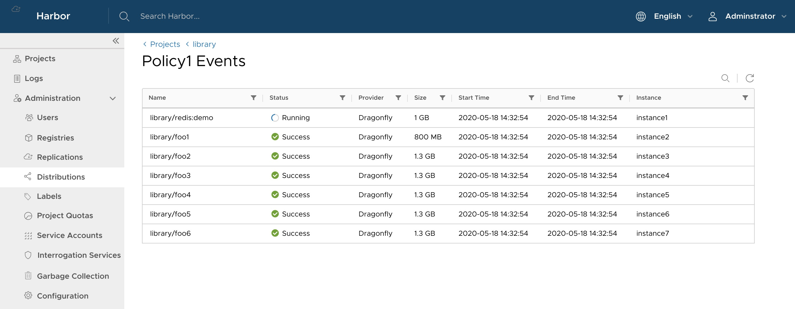

# Proposal: `P2P Preheat`

Author: Fanjian Kong / [Fanjian Kong](https://github.com/kofj) , Steven Zou / [Steven Zou](https://github.com/steven-zou)

Discussion:

- [P2P Distribution Epic](https://github.com/goharbor/harbor/issues/10875)
- [#5308](https://github.com/goharbor/harbor/issues/5308)
- [alibaba/Dragonfly#108](https://github.com/alibaba/Dragonfly/issues/108)
- [Legacy Proposal](https://github.com/goharbor/community/pull/13)

## Abstract

Preheat images to the P2P engines, cover Dragonfly and Kraken, and more engines in the future.

## Background

**Harbor:** Project Harbor is an open source trusted cloud-native registry project that stores, signs, and scans content. Harbor extends the open source Docker Distribution by adding the functionalities usually required by users such as security, identity, and management. Having a registry closer to the build and run environment can improve the image transfer efficiency. Harbor supports replication of images between registries and also offers advanced security features such as user management, access control, and activity auditing. For more details, please refer to [README](https://github.com/vmware/harbor/blob/master/README.md).

**Dragonfly:** Dragonfly is an intelligent P2P based file distribution system. It aims to resolve issues related to low-efficiency, low-success rate and a waste of network bandwidth in file transferring process. Especially in large-scale file distribution scenarios such as application distribution, cache distribution, log distribution, **image distribution**, etc. For more details, please refer to [README](https://github.com/alibaba/Dragonfly/blob/master/README.md).

**Kraken**: Kraken is a P2P-powered Docker registry that focuses on scalability and availability. It is designed for Docker image management, replication, and distribution in a hybrid cloud environment. With pluggable backend support, Kraken can easily integrate into existing Docker registry setups as the distribution layer. For more details, please refer to [README](https://github.com/uber/kraken/blob/master/README.md).

With the emergence and development of Kubernetes, it's becoming possible to run and operate large-scale containerized applications and services in enterprise environments. Meanwhile, there are still enormous challenges that cannot ignore. Distribution images to kubernetes work node is one of time-consuming steps in the container lifecycle. Research shows that time to take for image distribution accounts 76% of container start time: [FAST'16](https://www.usenix.org/node/194431).

To address the above challenge, wo should build a joint solution from the open source trust cloud-native reigstry Harbor and the open source intelligent P2P based file distribution systems.

**These there open sourced projects have very obviously complementary advantages to each others and the joint solution will definitely expand the scenarios of image lifecycle management and improve the securities, reliabilities, and efficiencies.**

## Proposal

### Overview

Preheat aims to let the P2P providers pull the images that match the related criteria (defined in the preheating policy or manually selected) into the P2P cache (Dragonfly supernode cache) or P2P network (Kraken no-cache) in advance to make sure the required images have been existing in the P2P network before the large scale runtimes start to pull and then to reduce the latency of “hotting” the P2P network as the 1st copy has already been there.

Preheat is a lightweight and loose-couple integration solution between Harbor and kinds of P2P providers. No dependencies for each other when doing the deployments. All the connections are set up through configurations and services calls are directly relying on the preheat API spec that defines several restful APIs.

#### Story

**Provider Management:**

- As a system user, Steven can add a new P2P preheat provider instance by providing the related require info like 'endpoint' and 'credential';
- As a system user, Steven can manage(view/search/update/delete) the existing P2P preheat provider instances;
- As a system user, Steven can set the selected preheat provider instance as the system default one;
- As a system user, Steven can enable or disable the selected preheat provider instance;

**Preheating Policy Management:**

- As a project admin, Frank can create a new preheat policy by setting the related data like 'provider', 'name', 'filters', 'criteria' and 'trigger' under the specified project;
- As a project admin, Frank can duplicate the selected preheating policy to create a new one under the specified project;
- As a project admin, Frank can manage(view/update/delete/disable) the existing preheating policies under the specified project;

**Execute Preheating Policies:**

- As a project admin, Frank can specify `event-based(ON-PUSH/ON-SCAN/ON-LABEL)` trigger way when creating the preheating policy under the specified project to let policy automatically execute when relevant events occurred;
- As a project admin, Frank can specify `schedule(CRON settings)` trigger way when creating the preheating policy under the specified project to let policy periodically execute following the settled CRON period;
- As a project admin, Frank can manually execute the selected preheating policy under the specified project;
- As a project admin, Frank can check all the execution history of the selected preheating policy under the specified project;

#### Architecture

The diagram shown below describes the overall architecture of P2P Preheat feature:


For the P2P providers, they need to provide APIs for covering the following functions:

- A health API for checking the connection status of the related P2P provider
- The preheat API that is the primary interface for accepting preheating requests from upstream Harbor
- A status API for reporting the preheating progress stats

As there may be different implementations of the above API for different P2P providers, we introduce the drivers to handle the differences. Other components use these drivers that have a unified interface to talk to the P2P providers.

The controller is the primary component to handle the overall preheating workflows including trigger preheating process per the request and track the progress of the triggered preheating. It also responds to the requests related to P2P endpoint management and preheating execution events querying.

The P2P endpoint instances are managed by the P2P provider manager and the related data are persisted in the database.

The preheat tracker is responsible for maintaining and persisting the preheating progress and the final history records.

The policy evaluator is designed to provide P2P preheating policy management and evaluation functions. Once the related criteria defined in the policy are matched, for example, the specified label is applied to the images or the pre-defined schedule time is coming, the JobService would be notified to start a preheating process immediately.

The JobService is designed to execute preheating process. When the JobService be notified to Start a preheating process, it will check the P2P Provider's health status first. And then, it will notifies the P2P provider to perform preheat operation.

#### Workflow

The diagram shwon below describes the workflow of P2P Preheat feature:


1. When a system administrator user adds a P2p provider instance to Harbor, Harbor will check status of the instance first, and if the instance is healthy(Return 200 HTTP status code), it will be added successfully.
2. The Harbor project administrator can add a preheating policy under special project , specify the type of artifact that is needed, and use a filter to select specific artifact.
3. The preheating function can be triggered by manual, scheduled policy or push event (ON-PUSH/ON-SCAN/ON-LABEL). Scheduled policy can be update to set CRON schedule, it will submit a periodical job to the JobService. Event-based can be update to set event-based trigger and subscribe ON-PUSH/ON-SCAN/ON-LABEL events. Manual policy will be list by the project administrator to select and execute.
4. When preheating is triggered manually, by an event or by scheduled policy, the Harbor will create and run a preheat JobService task. When a task starts running, it will check health status of the P2P provider first, if Provider is healthy it should return HTTP 200 status code to the task, the task will notifies the P2P provider to perform preheat operation with some artifact info(Like token and artifact for pulling); upon receipt of the notification, the provider responds to the Harbor in response to the HTTP 200 status code to accept the request and starts pulling the artifact to the P2P network. If the preheating resource has exist in the network, provider should return the HTTP 200 status code. If Harbor and provider communication times out or Provider health check failed, the task will tries to retry 3 times until success or failed.
5. After the preheating is started, the JobService will circularly request the P2P provider to inquire the preheating execution progress, and until the state of preheating executed by the P2P provider reaches the final, such as FINISHED or FAILED, and Harbor will updates the preheating status information to the event log.

#### Policy-based driven

P2P preheat is driven by policy. The policy contains the following main sections:

1. basic info:

- name
- description

2. provider:

- p2p preheat provider with pattern vendor name
- endpoint

1. Filters:

- repositories filter: filter repositories by their names (double star pattern)
- tag filter: filter tags

4. Criteria:

- Signature: decided if only signed images can be preheated
- vulnerability: decide if the images matching the expected vulnerability situations can be preheated
- labels: decide if images with the specified labels can be preheated

5. Trigger:

- None: manual
- Event-Based: when the specified events occurred, including on-push, on-scan and on-label
- Schedule: periodical executing following the specified CRON

### Interface and models

#### Preheating Driver interface

```go
type Driver interface {
	// Info returns the metadata of the driver
	Info() *Metadata
	// Try to get the health status of the driver.
	// If succeed, a non nil status object will be returned;
	// otherwise, a non nil error will be set.
	GetHealth() (*DriverStatus, error)

	// Preheat the specified image
	// If succeed, a non nil result object with preheating task id will be returned;
	// otherwise, a non nil error will be set.
	Preheat(preheatingImage *PreheatImage) (*PreheatingStatus, error)

	// Check the progress of the preheating process.
	// If succeed, a non nil status object with preheating status will be returned;
	// otherwise, a non nil error will be set.
	CheckProgress(taskID string) (*PreheatingStatus, error)
}
```

#### Structs job service

```go
type PreheatingStatus struct {
	TaskID     string `json:"task_id"`
	Status     string `json:"status"`
	Error      string `json:"error,omitempty"`
	StartTime  string `json:"start_time"`
	FinishTime string `json:"finish_time"`
}

// Jobs for preheat
// PreheatJob : the name of the P2P preheat job in job service
const PreheatJob = "PREHEAT_JOB"
// PREHEAT_SCHEDULER_JOB : the name of the P2P preheat scheduler job in job service
const PreheatSchedulerJob = "PREHEAT_SCHEDULER_JOB"

// Artifact type
const PreheatingArtifactTypeImage = "Image"

// Status of preheating job
const PreheatingStatusPending = "Pending"
const PreheatingStatusRunning = "Running"
const PreheatingStatusFinished = "Finished"
const PreheatingStatusFailed = "Failed"

// Preheat implements the job interface
type Preheat struct{}

// Scheduler is a job running in Jobservice which can be used as
// a scheduler when submitting it as a scheduled job. It receives
// a URL and data, and post the data to the URL when it is running
type Scheduler struct {}
```

#### Preheat Metadata Model

```go
type Metadata struct {
	ID             int64  `orm:"pk;auto;column(id)" json:"id"`
	Name           string `orm:"column(name)" json:"name"`
	Description    string `orm:"column(description)" json:"description"`
	Provider       string `orm:"column(provider)" json:"provider"`
	Endpoint       string `orm:"column(endpoint)" json:"endpoint"`
	AuthMode       string `orm:"column(auth_mode)" json:"auth_mode"`
	AuthData       string `orm:"column(auth_data)" json:"auth_data"`
	Extensions     string `orm:"column(extensions)" json:"extensions"`
	Status         string `orm:"column(status)" json:"status"`
	Enabled        bool   `orm:"column(enabled)" json:"enabled"`
	SetupTimestamp int64  `orm:"column(setup_timestamp)" json:"setup_timestamp"`
}
```

#### Policy Model

```go
const EventTypeScanned = "Scanned"
const EventTypeSigned = "Signed"
const EventTypeLabeled = "Labeled"

type Trigger struct {
	// Type: manual, schedule, event
	Type string `json:"type"` // The preheat policy trigger type. The valid values ar manual, scheduled.
	// Event type: scanned, push, labeled
	Event          string `json:"event,omitempty"`
	TriggerSetting struct {
		Cron string `json:"cron,omitempty"` // The cron string for scheduled trigger.
	} `json:"trigger_setting,omitempty"`
}

// FilterType represents the type info of the filter.
type FilterType string

// Filter holds the info of the filter
type Filter struct {
	Type  FilterType  `json:"type"`
	Value interface{} `json:"value"`
}

const CriteriaTypeScanned = "Scanned"
const CriteriaTypeSigned = "Signed"
const CriteriaTypeLabeled = "Labeled"

type PreheatPolicy struct {
	ID          int64     `orm:"column(id)" json:"id"`
	Name        string    `orm:"column(name)" json:"name"`
	Description string    `orm:"column(description)" json:"description"`
	ProjectID   int64     `orm:"column(project_id)" json:"project_id"`
	TargetID    int64     `orm:"column(target_id)" json:"target_id"`
	Filters     []*Filter `orm:"column(-)" json:"-"`
	FiltersStr  string    `orm:"column(filters)" json:"filters"`
	// Criteria type: scanned、signed、labeled
	Criteria    string    `orm:"column(criteria)" json:"criteria"`
	Trigger     Trigger   `orm:"column(-)" json:"-"`
	TriggerStr  string    `orm:"column(trigger)" json:"trigger"`
	Enabled     bool      `orm:"column(enabled)" json:"enabled"`
	CreatedAt   time.Time `orm:"column(creation_time)" json:"creation_time"`
	UpdatedTime time.Time `orm:"column(update_time)" json:"update_time"`
}
```

#### Event Model

```go
type Execution struct {
	ID          int64     `orm:"column(id)" json:"id"`
	PolicyID    int64     `orm:"column(policy_id)" json:"policy_id"`
	TriggerType string    `orm:"column(trigger_type)" json:"trigger_type"`
	TaskID      string    `orm:"column(task_id)" json:"task_id"`
	Artifacts   string    `orm:"column(artifacts)" json:"artifacts"`
	Status      string    `orm:"column(status)" json:"status"`
	Error       string    `orm:"column(result)" json:"result,omitempty"`
	StartTime   time.Time `orm:"column(start_time)" json:"start_time"`
	FinishTime  time.Time `orm:"column(finish_time)" json:"finish_time"`
}
```

### APIs

#### 1. APIs for instance

Create prepheat instance

```
POST /preheat/instances
Data:
{
    "name": "someInstance",
    "description": "this is draganfly instance.",
    "provider": "drangfly",
    "endpoint": "http://abc.com/",
    "auth_mode": "none",
    "enabled": false
}
```

List instances

```
GET /preheat/instances
```

Update instance

```
PUT /preheat/instances/{id}
Data:
{
    "description": "this is draganfly instance.",
    "provider": "drangfly",
    "endpoint": "http://abc.com/",
    "auth_mode": "none",
    "enabled": false
}
```

Delete instances

```
DELETE /preheat/instances/{id}
```

### 2. APIs for policy

Create Preheat policy

```
POST /preheat/policies
Data:
{
    "name": "by-cron",
    "description": "preheating by push cron",
    "target": 1,
    "trigger": {
        "type": "cron",
        "trigger_setting": {
            "cron": "*/1 * * * *"
        }
    },
    "filters": "",
    "artifact_type": "image",
    "enabled": true
}
```

List preheat policy

```
GET /preheat/policies
```

Update preheat policy
Data:
{
"name": "by-cron",
"description": "preheating by push cron",
"target": 1,
"trigger": {
"type": "cron",
"trigger*setting": {
"cron": "*/1 \_ \* \* \*"
}
},
"filters": "",
"artifact_type": "image",
"enabled": true
}

```
GET /preheat/policies/{id}
```

Update

```
PUT /preheat/policies/{id}
Data:
{
    "description": "preheating by push cron",
    "target": 1,
    "trigger": {
        "type": "cron",
        "trigger_setting": {
            "cron": "*/1 * * * *"
        }
    },
    "artifact_type": "image",
    "enabled": true
}
```

Delete preheat policy

```
DELETE /preheat/policies/{id}
```

#### 3. APIs for preheating

```
POST /preheat/executions
Data:
{
   "policy_id": 12345
}
```

List executions of preheat

```
GET /preheat/executions
```

Get execution of preheat

```
GET /preheat/executions/{id}
```

Stop execution of preheat

```
PUT /preheat/executions/{id}
```

### UE Mock/introduction

#### Provider instances



#### P2P Provider Policies of project



#### Events of P2P Provider Policy's job



### development plan

The P2P preheat feature will be implemented by the Harbor community's P2P Workgroup, and we'll follow the timeline of 2.1 to deliver.
