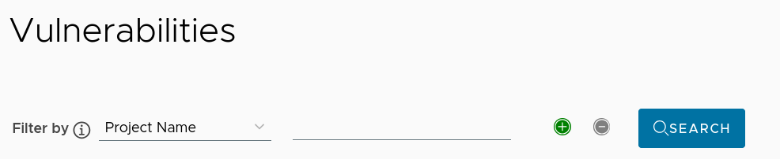

# Proposal: `Project-level access to Security Hub`

Author: [Ankur Kothiwal](https://github.com/ankurk99/)

## Abstract

This proposal aims to extend Security Hub access from administrators only to project administrators. This will enable project-specific teams to monitor and respond to security vulnerabilities within their own projects without requiring harbor administrator intervention.

## Background

Currently, Harbor's Security Hub dashboard provides valuable insights into detected vulnerabilities across the system but is only accessible to global administrators. This limitation prevents project owners from independently monitoring the security status of their own projects. Project teams need direct access to security information to take timely actions to remediate vulnerabilities.

## Motivation

Allowing project owners to access Security Hub for their own projects will:

1. Improve project-level security visibility without requiring administrator involvement  
2. Enable decentralized security management and faster response to vulnerabilities  
3. Allow teams to implement security-focused DevSecOps practices  
4. Reduce the workload on global administrators  
5. Bring Security Hub access in line with other project-specific resources like robot accounts and labels

## Goals

* Enable project owners/admins to view Security Hub data limited to their own projects  
* Security manager role: this role will only be able to access the Security Hub  
  * Use case: To provide security team access to the Security Hub without the admin access to the whole registry instance  
* Maintain data isolation between projects  
* Preserve the global view for system administrators  
* Modifying filtering  
* In the current filters, we can only search for single fields \- For eg. We can only search for a specific vulnerability in a specific project. Checking a CVE in multiple projects, or multiple CVEs in a single project is not possible.


* Implement consistent permissions that aligns with existing Harbor RBAC  
* Provide an intuitive user experience for users with access to multiple projects

## Non-Goals

1. Providing Security Hub access to roles other than projectAdmin: Configurable to allow users of the project to have access to Security Hub  
2. Accordingly modifying “Scanners” and “Vulnerability” under the Interrogation Service  
   1. Configure the scanner project admins want to use  
   2. This will include allowing the users to schedule and run “Scan now” on all their projects  
3. Changing the data collection or presentation of vulnerability information  
4. Adding new scanning capabilities or integrations

## Proposal / Design Details

### 1\. Permission Model and RBAC

* **Implicit Permission:** The projectAdmin role will implicitly be granted permission to view the Security Hub for the projects they administer.  
* **RBAC Enforcement:**  
  * Harbor's backend RBAC (Role-Based Access Control) mechanisms will be updated.  
  * When a user attempts to access the Security Hub data for a specific project, the system will verify if the user holds the projectAdmin role for that project.

### 2\. Backend Changes

#### API Endpoints

The current global Security Hub is assumed to be served by endpoints like /api/v2.0/securityhub/.... We will introduce new project-scoped API endpoints:

* GET /api/v2.0/projects/{project\_name\_or\_id}/security/summary  
  * Returns vulnerability summary statistics for the specified project.

```json
{
  "critical_cnt": 0,
  "high_cnt": 0,
  "medium_cnt": 0,
  "low_cnt": 0,
  "none_cnt": 0,
  "unknown_cnt": 0,
  "total_vuls": 0,
  "scanned_cnt": 0,
  "total_artifact": 0,
  "fixable_cnt": 0,
  "dangerous_cves": [
    {
      "cve_id": "string",
      "severity": "string",
      "cvss_score_v3": 0,
      "desc": "string",
      "package": "string",
      "version": "string"
    }
  ],
  "dangerous_artifacts": [
    {
      "project_id": 0,
      "repository_name": "string",
      "digest": "string",
      "critical_cnt": 0,
      "high_cnt": 0,
      "medium_cnt": 0
    }
  ]
}
```

* GET /api/v2.0/projects/{project\_name\_or\_id}/security/vul  
  * Returns a list of vulnerabilities for the specified project, supporting pagination and filtering within that project's scope.

```json
[
  {
    "project_id": 0,
    "repository_name": "string",
    "digest": "string",
    "tags": [
      "string"
    ],
    "cve_id": "string",
    "severity": "string",
    "cvss_v3_score": 0,
    "package": "string",
    "version": "string",
    "fixed_version": "string",
    "desc": "string",
    "links": [
      "string"
    ]
  }
]
```

* GET /api/v2.0/projects/{project\_name\_or\_id}/security/summary/dangerous\_artifacts  
  * Returns the top N most dangerous artifacts within the specified project.  
* GET /api/v2.0/projects/{project\_name\_or\_id}/security/summary/dangerous\_cves  
  * Returns the top N most dangerous CVEs affecting the specified project.

Here, *{project\_name\_or\_id}* can be the project's name or its numerical ID.

* The core change will be to ensure all database queries for vulnerability data are filtered by the project\_id derived from {project\_name\_or\_id}.  
* Aggregation logic (e.g., for summaries, top N lists) will operate on this project-scoped dataset.  
* **Response Structure:** The JSON response structure for these project-scoped endpoints will closely mirror that of the current SecurityHub APIs so that the current frontend component reuse can be maximised.

### 3\. Frontend (UI/UX) Changes

The aim is to maximize the usage of the present securityhub dashboard.

* **Navigation:** Currently, the “Interrogation Service” is a part of the “Administration” menu. For non-admin users, we can have this as a separate menu together with “Projects” and “Logs”.  
* **Dashboard View:**  
  * The UI components (charts, tables, filters) from the existing global Security Hub will be reused.  
  * These components will be initialized with data fetched from the new project-scoped API endpoints.  
* **Search and Filtering:**  
  * All the projects owned by the user can be filtered  
    * Search and filter functionalities (by CVE, severity, etc.) within the project-scoped Security Hub will operate only on the data for that project.

### 4\. System Administrator View

The current global Security Hub remains unchanged.

**Implementation:**
Security Hub already has a project level filter. We need to map this to project admins, so that users can only view their own projects.



* For users who administer multiple projects:
* A consolidated dashboard showing security metrics across all their projects
* Allow viewing common vulnerabilities across multiple projects
* Implement multi-select filtering to allow users to search for multiple CVEs simultaneously  
  * By default, user will see vulnerabilities across all the projects  
  * For filtering there will be a dropdown menu containing the list of projects to which they have access to

## Rationale

* **Access rights could be modified so that harbor administrators could grant access to this dashboard to their users:** This will put extra burden on harbor administrators to provide these permissions. It will be much simpler to provide already present role based permission (for eg. projectAdmin). 

**Questions:**

* **Do we only provide Security Hub or the whole Interrogation Service (which contains choosing their own scanners and scheduling vulnerability scans)?**  
  We recommend initially providing only Security Hub access to project admins, without   
  scanner configuration capabilities. Scanner configuration should remain centralized with   
  Harbor administrators to ensure consistent security policies across projects. However, project admins should be able to trigger scans for their own projects.
